# 2D Graphics

### 引入
convert 2D primitives into a raster image
+ for output on a monitor/printer
+ rasterization or scan conversion

CRT:阴极射线管 

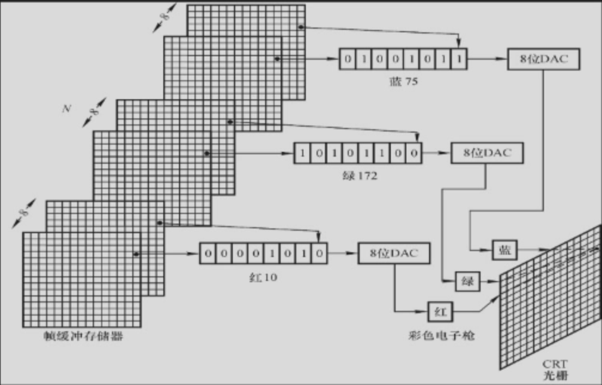

光栅是为了减少相邻电子之间的干扰

LCD:

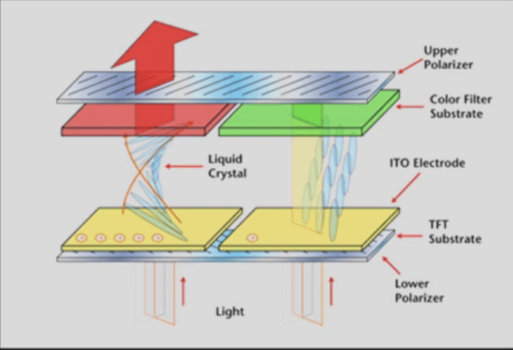   

efficiency is most important to the performance of a display system

高性能的算法一般都固化在硬件中,Modern PCs (video cards)

## Line Segments

坐标系：笛卡尔坐标系，定义在整数点上

### Scan converting a line segment
线是建模世界很有力度元素。线段是由两个端点定义的，端点的 pixels 和 color。

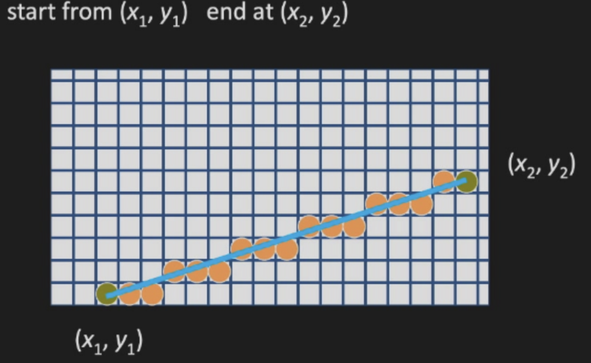   

Requirement:
+ the selected pixels should lie as close to the ideal line as possible
+ the sequence of pixels should be as straight as possible
+ all lines should appear to be of constant brightness independent of their length and orientation
+ should start and end accurately
+ should be drawn as rapidly as possible
+ should be possible to draw lines with different width and line styles

How to draw a line:

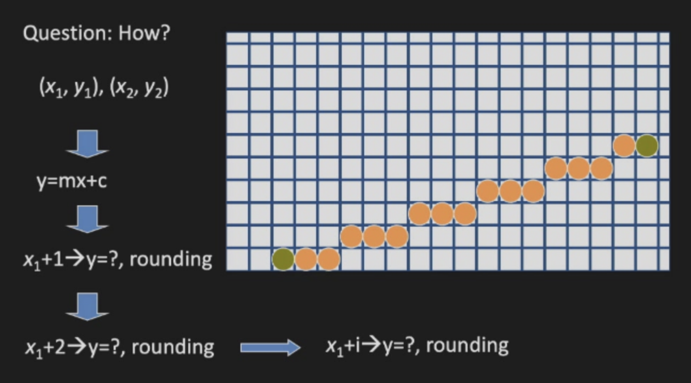

+ Equation of a line: $y = mx +c$ , for line starting at $(x_0, y_0)$ and ending at $(x_1, y_1)$, we have $m = \frac{y_1 - y_0}{x_1 - x_0} = \frac{\Delta y}{\Delta x}$

+ Digital Differential Analyzer (DDA) Algorithm:

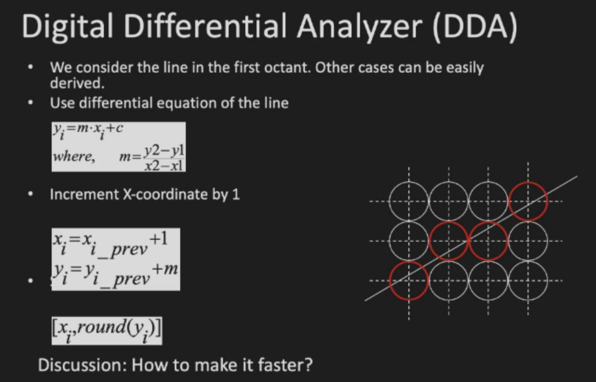

如何要获得只用整数运算的算法，从而完全避免浮点数？

+ Bresenham's Line Drawing Algorithm

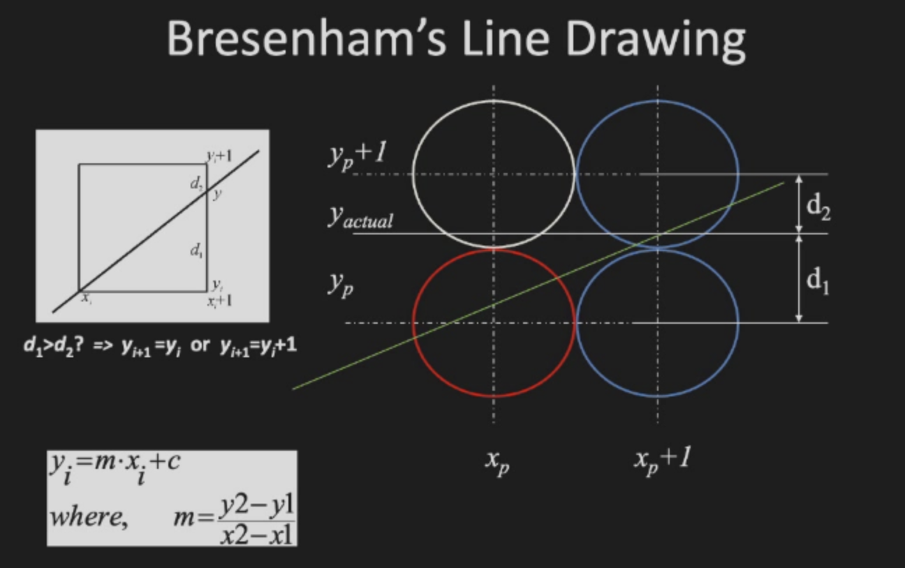

Some equations:

$$
\begin{aligned}
& y = m(x_i + 1) + b \qquad & dx= x_2-x_1  \\
& d_1 = y - y_i  \qquad & dy = y_2-y_1 \\
& d_2 = y_i + 1 - y  \qquad & m=dy/dx
\end{aligned}
$$

if $d_1 - d_2 > 0$,then $y_{i+1} = y_i + 1$, otherwise $y_{i+1} = y_i$
$d_1-d_2=2y-2y_i-1=2dy/dx*x_i+2dy/dx+2b-2y_i-1$
both $*dx$, donate $(d_1-d_2)dx$ as $p_i$, we have 
$p_i=2x_{i+1}dy - 2y_{i+1}dx+2dy+(2b-1)dx$
$p_{i+1}=p_i+2dy-2(y_{i+1}-y_i)dx$

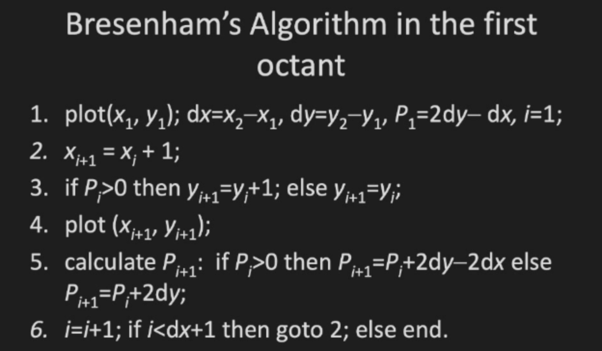

### 3D lines

## Circles
A circle with center $(x_c, y_c)$ and radius $r$ is defined by the equation $(x - x_c)^2 + (y - y_c)^2 = r^2$

用类似的直角坐标计算依然需要根据45度进行划分，这里考虑用极坐标convert

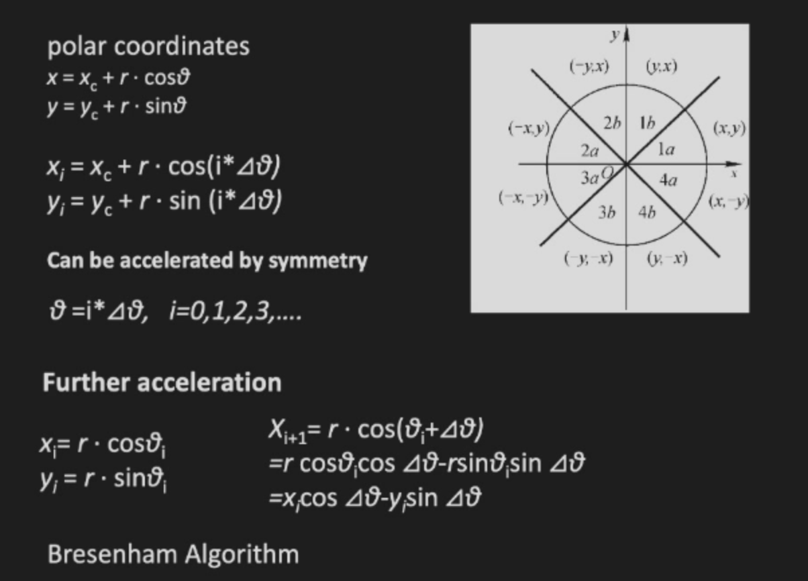

问题在于这里使用增量的形式会导致误差的累积

## Polygons
### Filling Polygons 填充多边形
+ even-odd test / winding number test

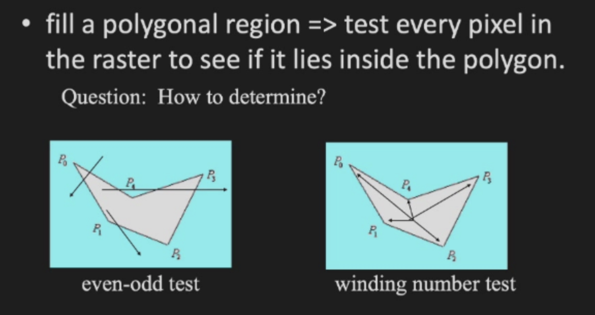

scan-line algorithm
+ Use intersections between region boundaries and scan lines to identify pixels that are inside the area
+ Exploit the coherence
  + Spatial coherence: Except at the boundary edges, adjacent pixels are likely to have the same characteristics
  + Scan line coherence: Pixels in the adjacent scan lines are likely to have the same characteristics

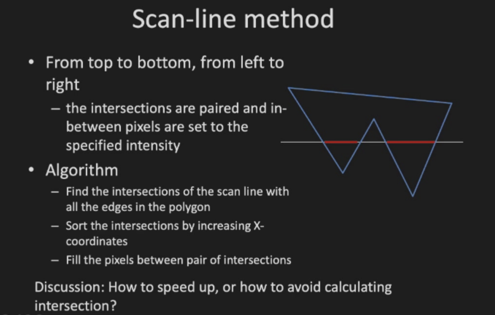

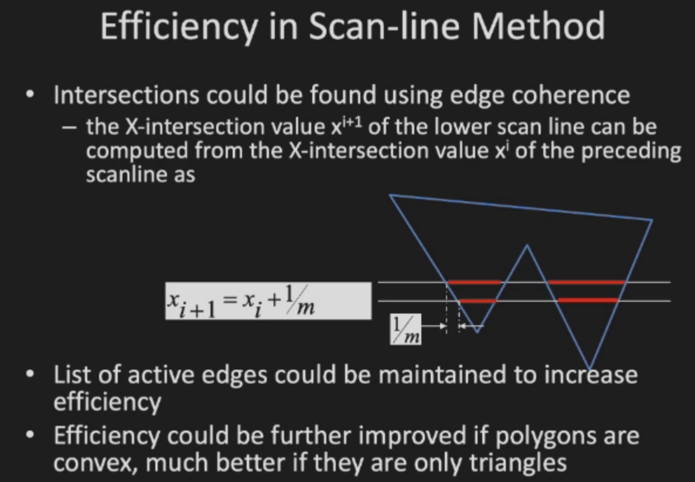

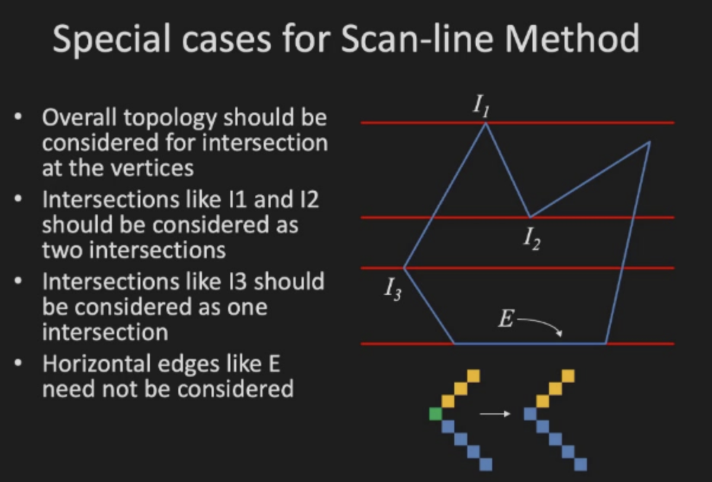

Seed fill algorithm
+ Assumes that at least one pixel inside the polygon is known
+ A recursive algorithm
+ Useful in interactive painting packages

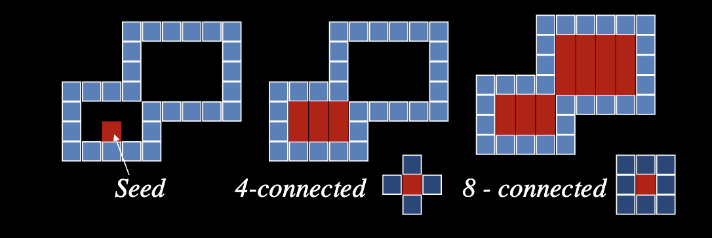

## clipping

Removal of content that is not going to be displayed

在convert之前做，是为了efficient