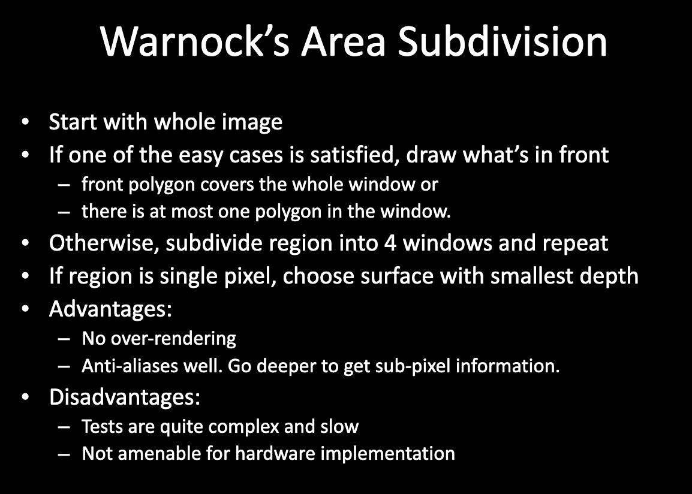

# Antialiasing

## VisualRealism
+ View(persective)
+ Field of view(proper clipping)
+ **Omit hidden parts**
+ Surface details like texture
+ Light effects on surfaces like continuous shading,shadows and caustics

!!! note Realted OpenGL Functions
    + glEnable/glDisable(GL_CULL_FACE);
    + glCullFace(mode);
    + glutInitDisplayMode(GLUT_DOUBLE | GLUT_RGB | GLUT_DEPTH);
    + glEnable(GL_DEPTH_TEST);

+ Visible Surface Determination
+ Goal
  + Given: a set of 3D objects and view specification
  + Determine: those parts of the objects that are visible when viewed along the direction of projection
+ Or, equivalently, elimination of hidden parts(hidden lines and surfaces)
+ Visible parts will be drawn/shown with proper shading

+ Approaches
  + Object space methods
    + Object precision
  + Image space methods
    + Image precision
  + z-buffer algorithm

+ Object precision
  + for(each object in this world){determine the parts of the object whose view is unobstructed by other parts or any other object;drawthoseparts;}
+ Image Precision Algorithm
  + for(each pixel in the image){画出最近的pixel}

+ Back-face Culling：背面是不可能被看到的。怎么做？
1. Find angle between the eye-vector & normal to face
2. If the angle is between 0 and 90 degrees, discard the face

If the scene consists of a single closed convex polygonal surface,then back-face culling is equivalent to hidden surface removal.

+ Painter's Algorithm: Back to Front
+ Warnock's Area Algorithm: Divide and Conquer

<center></center>

<center></center>

## Z-buffer Algorithm

- Apart from a frame buffer F in which color values are stored.
- it also needs a z-buffer, of the same size as frame buffer,to store depth(z) values.存的是离得最近的深度值，z值更小的就是离得更近的

```cpp
for(j=0;j<SCREEN_HEIGHT;j++)
{
    for(i=0;i<SCREEN_WIDTH;i++)
    {
        WriteToFrameBuffer(i,j,BackgroundColor);
        WriteToZBuffer(i,j,MAX_DEPTH);
    }
}
for(each polygon)
    for(each pixel in the polygon projection)
    {
        z = polygon.z at (i,j);
        if(z < ReadFromZBuffer(i,j))
        {
            WriteToFrameBuffer(i,j,polygon.color);
            WriteToZBuffer(i,j,z);
        }
    }
```

如果更小就更新，因为更近。越深越近

<center></center>

!!! note Realted OpenGL Functions
    + glClearBuffer(red,green,blue,alpha)
    + glClearDepth(depth)
    + glClear(GL_COLOR_BUFFER_BIT|GL_DEPTH_BUFFER_BIT)
    + glEnable(GL_DEPTH_TEST)
    + glDisable(GL_DEPTH_TEST)
    + glDepthFunc(GL_LESS)

+ Binary Space Partitioning Trees:BSP Tree
  + Very efficient for static group of 3D polygons as seen from an arbitary viewpoint
  + Correct order for Painter's Algorithm is determined by a traversal of the binar tree of polygons

<center></center>

<center></center>

## Aliasing

采样率/分辨率不够，看到锯齿

Anti-aliasing: 降低锯齿

+ Super-samping:一个sampling 取不止一个点，增加采样率
+ Area sampling:

<center></center>