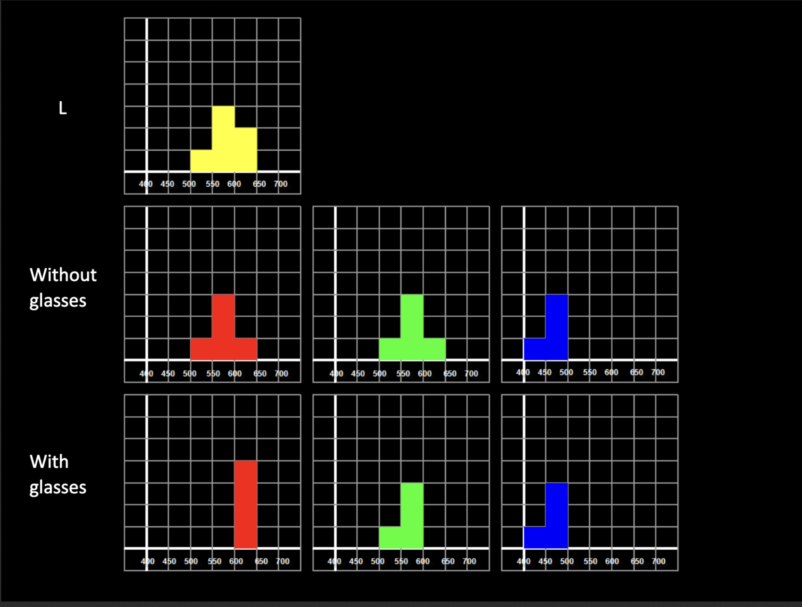
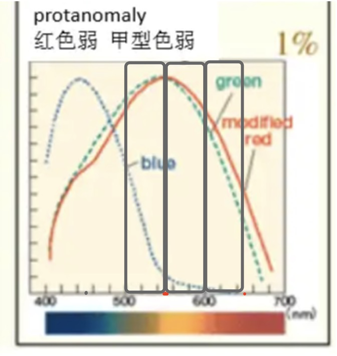

对于色盲人群，这种眼镜无效，原因是色盲人群缺少一种光感受器，但是对于色弱人群有效果（即两种光感受器的敏感度很接近导致很难区分对应的光）

视锥细胞对某个特定光谱的相应可以用下面的方式计算

$$
r = \int f(x)s(x)\text{d}x
$$

这里的 $s(x)$ 表示视锥细胞的光谱敏感度函数，这是色弱的根本原因。$f(x)$ 则是光谱的能量分布，EnChroma 太阳镜的作用就是过滤一部分光，改变这个光谱的能量分布，从而达到修改视锥细胞响应的效果。

具体来说，下面一格作为单位1，

 

在无眼镜的情况下，红色的积分结果与绿色的积分结果应该是一致的（曲线近似一致）。在近似为线性的时候，积分转化为均值乘以面积，可以看到在 500 - 600 区间内，敏感度是较高的（约80%），600-650的区间内敏感度较低（约60%），所以在有眼镜的情况下绿色的积分结果(80% * 4 = 3.2)会比红色的积分结果(60% * 4 = 2.4)要大，后者是前者的 3/4.

对于潜在的问题，由于过滤掉了一部分的光，那么戴着眼镜去看单色光的时候肯定会出现偏差，会影响视觉观察。