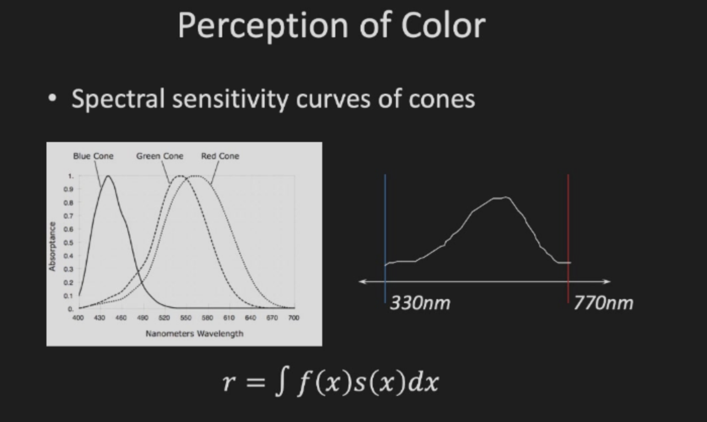

# Color

## Color Classification

+ Color is the brain's reaction to a specific visual stimulus
+ Subjective sensation experienced by the observer.There is no such thing called color without an observer
+ Depends on
  - Physics of light
  - Interaction of light with physical materials
  - Interpretation of the resulting phenomenon by the human visual system and the human brain

物理光学/光的性质（波长、频率）/光谱

+ r:代表视锥细胞对某个特定光谱的响应。
+ f(x):表示光谱能量分布，描述不同波长的光强度。例如，在自然光或其他光源下，不同波长的光子分布强度可能不同。
+ s(x):表示视锥细胞的光谱敏感度函数。视网膜上的视锥细胞（蓝色、绿色和红色视锥细胞）对不同波长的光有不同的敏感性，曲线的峰值表示视锥细胞最敏感的波长范围。

Color Models:
+ RGB:Red/Green/Blue
+ CMYK:Cyan/Magenta/Yellow/Black
+ HSV:Hue/Saturation/Value
+ Lab:Perceptual color space

Shader communication: