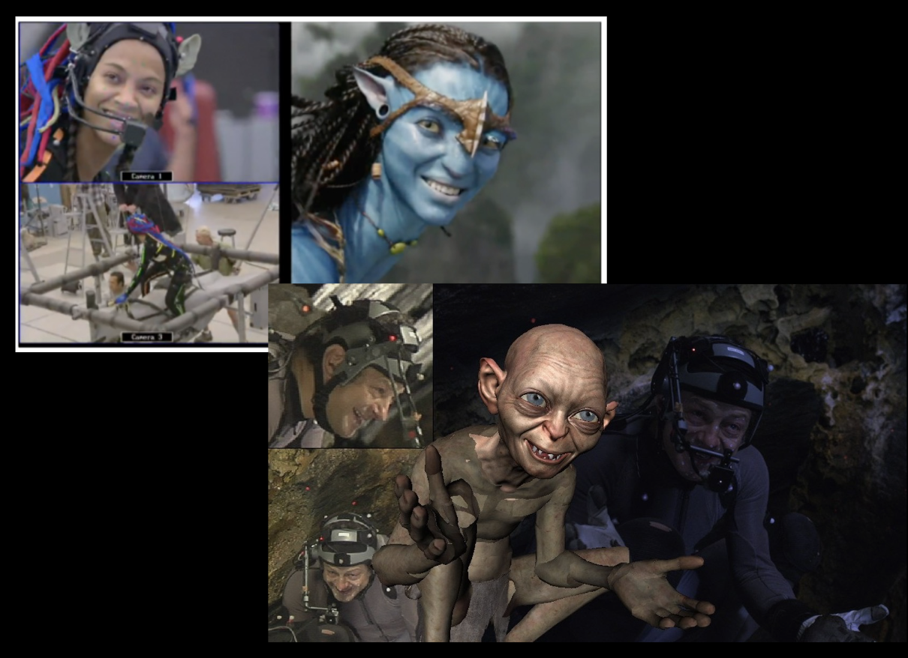

# intro

Pixel = **Pic**ture **El**ement
Three fundamental Tasks

+ Modeling
+ Animation(Simulating)
+ Rendering(displaying)

## Modeling
Digital Representation of the world
+ Digital Images
+ 3D Geometric Objects (Graphics)
+ Symbolic Descriptions

Three important and complex attributes
+ Shape
+ Visual look or appearance
+ Dynamic behaviors due to interactions with other elements of the world

## Simulating the behaviors of objects in the world

Demo

## Rendering the world

I/O of computer graphics
+ input
  + Object(shape,material,lighting)
+ output
  + Image:array of pixels

## Topics Covered in This Course
+ Basic
  + Transformations and Synthetic Camera for Viewing the World
+ Modeling techniques and tools
  + Meshes, Surfaces and Solid Objects
+ Rendering techniques
  + Visibility computation
  + Illumination models
  + Realistic rendering algorithms
+ Texture Mapping
+ Advanced modelling and rendering methods
  + complex lighting effects, natural objects and volumetric objects