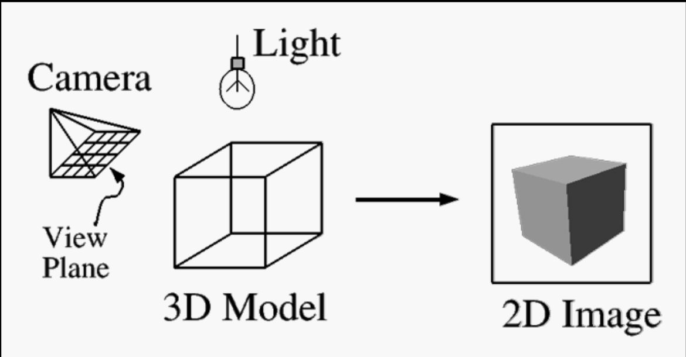

# OpenGL

key task: 将三维的物体投影到二维的屏幕上

  

## OpenGL toolchain
+ OpenGL `#include <GL/gl.h>`
  + Platform-independent “core” library
+ GLU `#include <GL/glu.h>`
  + an auxiliary library that handles a variety of graphics accessory functions
+ GLUT `#include <GL/glut.h>`
  + an auxiliary library that handles window creation, OS system calls (mouse buttons, movement, keyboard, etc.)

Three States in OpenGL
+ Define Objects in World Space
+ Set Modeling and Viewing Transformations
+ Render the Scene

## How it work
+ OpenGL is a state machine
+ Give orders to set the current state of any one of its internal variables, or to query its current status
+ The current state won’t change until you explicitly specify a new value
  + if you set the current color to Red, everything you draw will be painted Red until you change the color explicitly
+ Each of the system’s state variables has a default value

## OpenGL Primitives
+ GL_POINTS
+ GL_LINES
+ GL_LINE_STRIP
+ GL_LINE_LOOP
+ GL_TRIANGLES
+ GL_QUADS
+ GL_POLYGON
+ GL_TRIANGLE_STRIP
+ GL_TRIANGLE_FAN
+ GL_QUAD_STRIP