# Viewing in 2D & 3D
## Viewing in 2D
+ The world is infinite but the screen is finite. Depending on the details the user wishes to see,she limits her view by specifying a window in this world.
+ 通过恰当的变换，我们可以将世界的任意部分映射到屏幕上。

<center>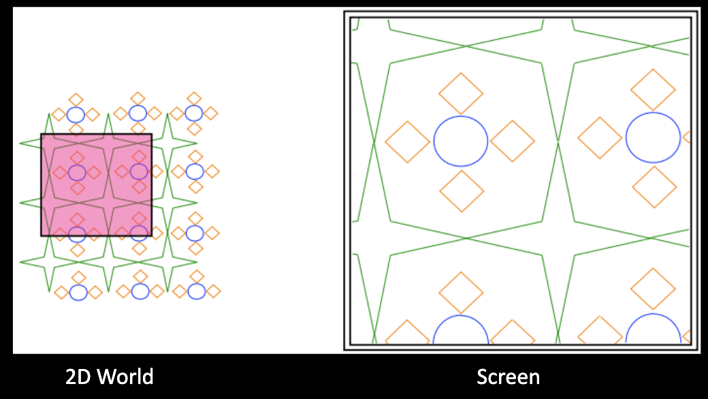</center>

### Window
+ The window is a rectangular region in the 2D world specified by
  + a center (xCenter, yCenter)
  + size windowSize
+ Screen referred to as the viewport is a discrete matrix of pixels specified by
  + size screenSize (in pixels)

### windows-to-viewport transformation

mapping the 2D world seen in the window onto the viewport is 2D viewing transformation.

<center>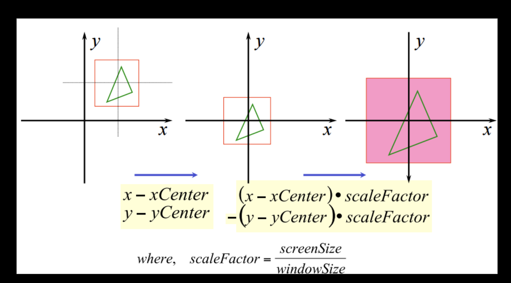</center>

因为视图里y轴方向从上向下，所以需要给 y 轴加一个负号

### Aspect Ratio
+ In 2D viewing transformation, the aspect ratio is maintained when the scaling is uniform.
  + scaleFactor is the same for both x and y

<center>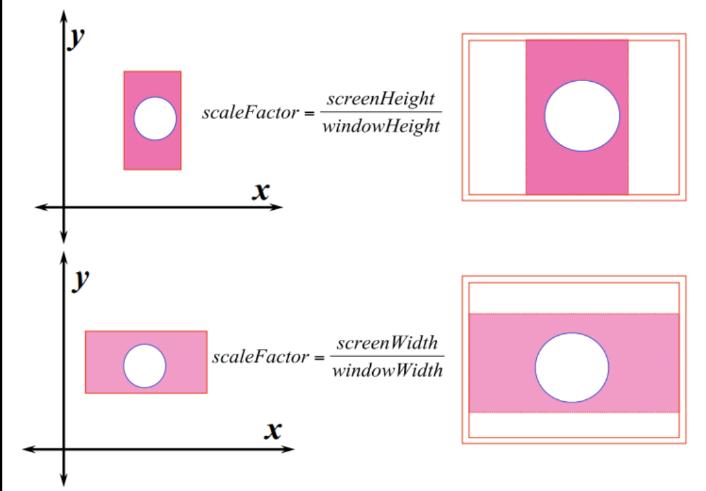</center>

### OpenGL Commands
```cpp
gluOrtho2D(left,right,bottom,top);
// Create a matrix for projecting 2D coordinates onto the screen
glViewport(x,y,width,height);
// Define a rectangle of pixels onto which the final image is mapped.
// (x,y) is the lower-left corner of the viewport rectangle
// width and height are the size of viewport rectangle
```

## Viewing in 3D

+ To display a 3D world on a 2D screen
  + Specification becomes complicated because there are many parameters to control
  + Additional task of reducing dimensions from 3D to 2D(projection)
  + 3D viewing is analogous to taking a picture with a camera

### Transformations/Camera Analogy

+ Modeling transformation
  + Shaping,position and moving the objects in the world scene.
+ Viewing transformation
  + Positioning and orienting the camera in the world scene, selecting the region of interest
+ Projection transformation
  + 调整焦距
+ viewport transformation
  + Enlarging or reducing the physical photograph

<center>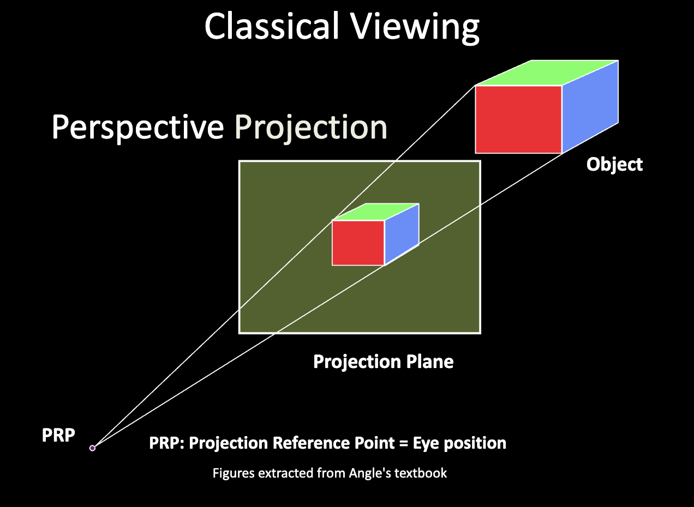</center>

### Perspective Projection 

透视投影
+ characterized by diminution of size
+ The farther the object, the smaller the image
+ Foreshortening depends on distance from viewer
+ Can't be used for measurements
+ Vanishing point

<center>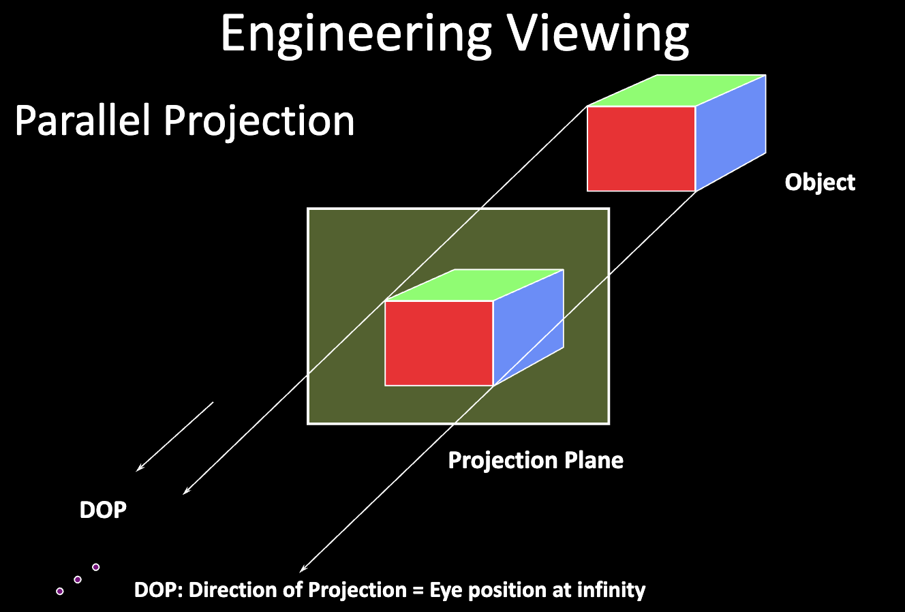</center>

### Oblique Projection
斜平行
+ Most general parallel views
+ Projectors make an arbitrary angle with the projection plane
+ Angles in planes parallel to the projection plane are preserved

## View Specification 

<center>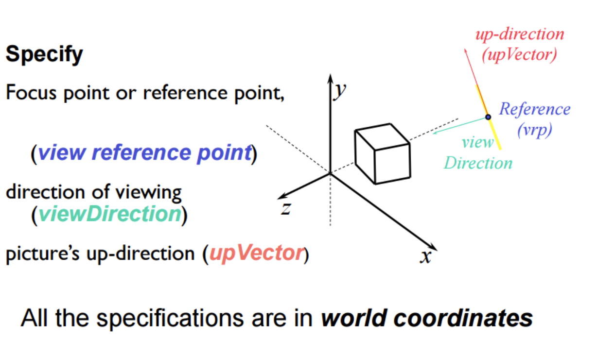</center>

+ View Reference Coordinate System

<center>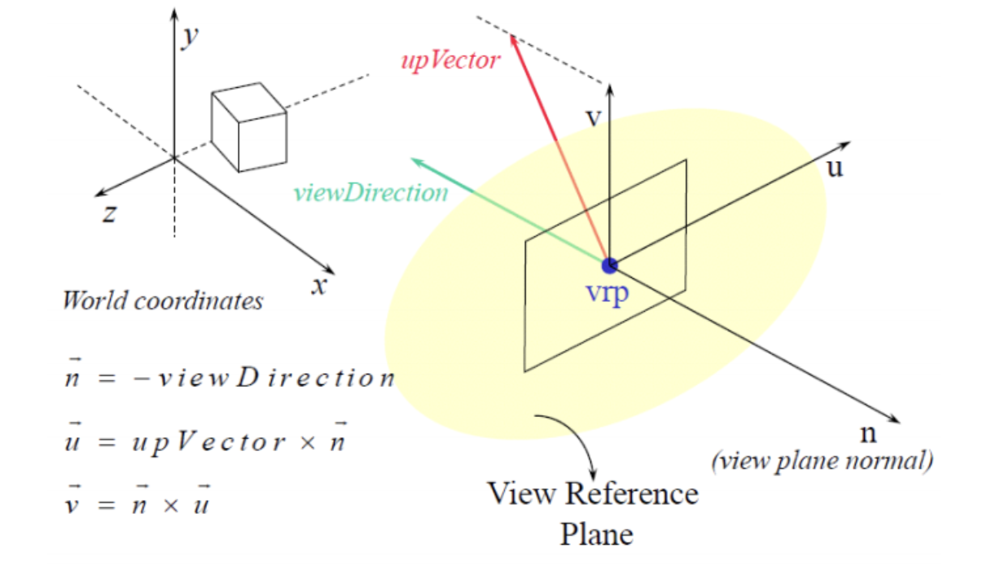</center>

View Up Vector: the orientation of the view window on the view reference plane

Once the view reference coordinate system is defined, the next step is to project the 3D world onto the view reference plane.

+ Simplest Camera Position

<center>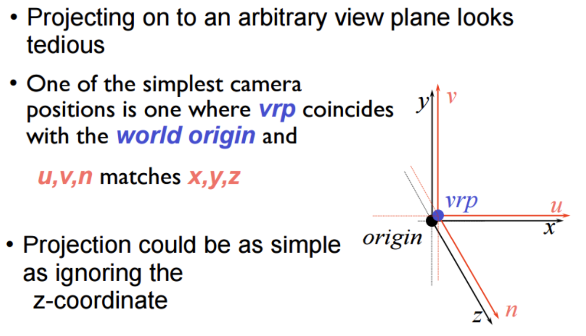</center>

+ Deriving the Viewing Orientation Matrix

<center>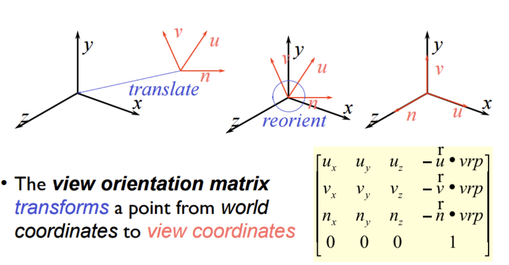</center>

+ Perspective Projection

<center>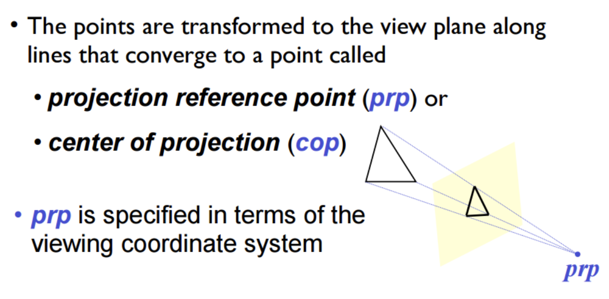</center>

+ Transfomation Matrix for perspective projection

<center>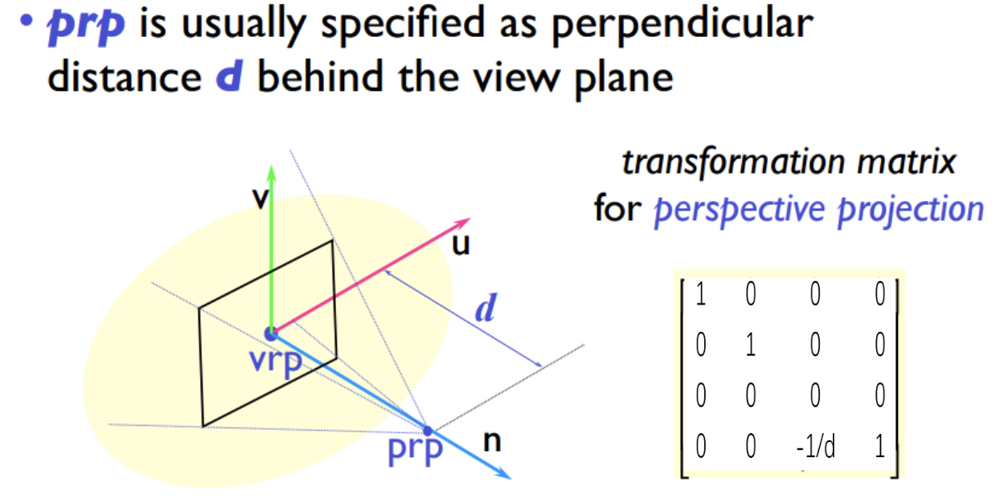</center>

+ View Window

<center>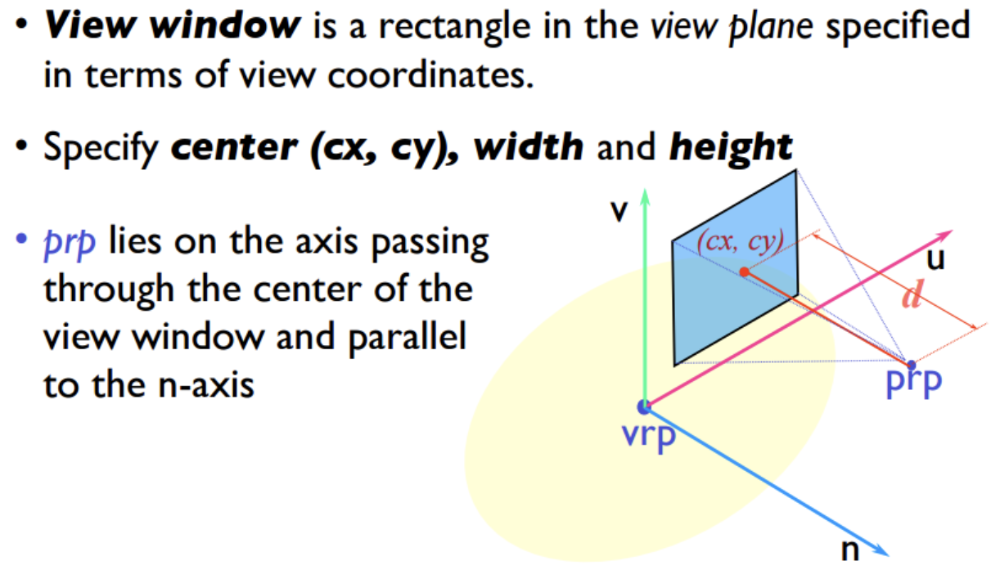</center>

### Perspective Viewing

1. Apply the view orientation transformation
2. Apply translation, such that the center of the view windows coincide with the origin
3. Apply the perspective projection matrix to project the 3D world onto the view reference plane

<center>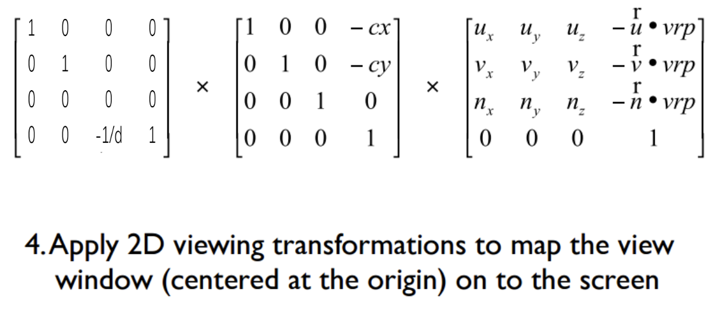</center> 

### Complete View Specification

+ Specification in world cooridinates

position of viewing(vrp), direction of viewing(-n), up direction for viewing(upVector)

+ Specification in view coordinates
  + view window: center(cx,cy), width and height
  + prp:distance from the view plane
  + from clipping plane:distance from view plane
  + back clipping plane:distance from view plane

<center>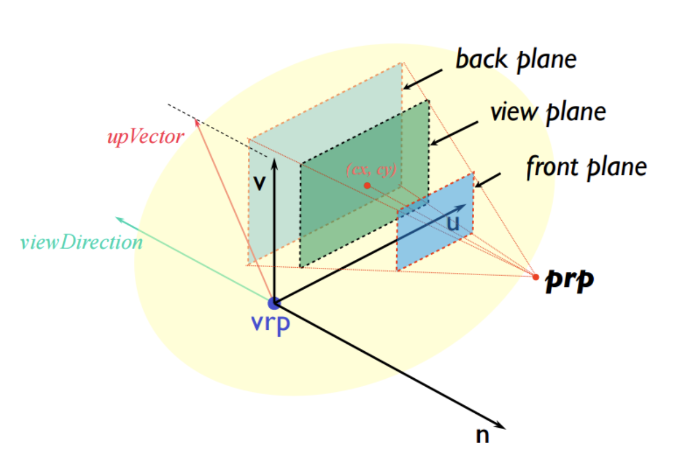</center>

<!-- ## OpenGL programming -->
