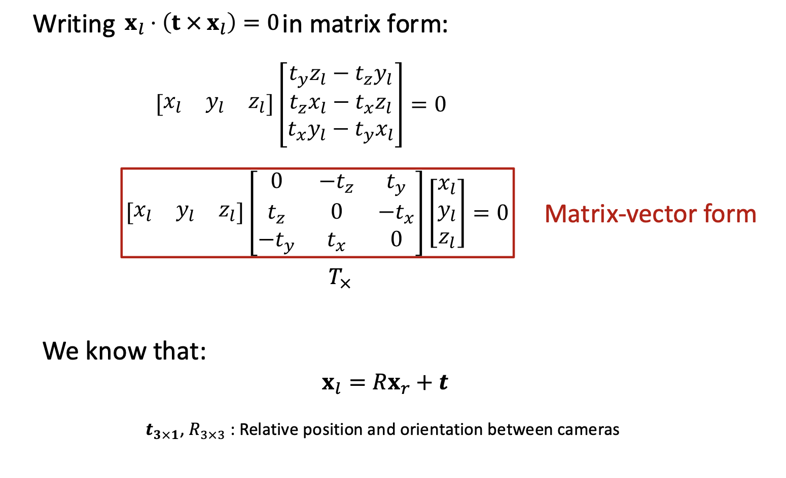

# Structure from Motion

即：从其图像中恢复相机姿势和场景的3D结构

## 需要注意的问题

+ 相机是如何将三维坐标点映射到图像平面上的？(camera model)
+ 如何计算相机在世界坐标系下的位置和方向?(camera calibration and pose estimation) 标定和位姿估计
+ 如何从图像中重建出不知道的三维结构？(structure from motion)

## Image Formation(camera model)

首先回顾一下图像形成的过程
1. 坐标系变换：把世界坐标系的点变换到相机坐标系
2. 透视投影：将相机坐标系的点投影到像平面上
3. 成像平面转化为像素平面

### 坐标系转换

Extrinsic parameters: 外参$(R,c_w)$分别代表从世界坐标向相机坐标的旋转矩阵和在世界坐标系下相机中心的坐标

旋转矩阵是标准正交的。变换后的坐标是

$$
x_c = R(x_w - c_w) = R x_w - R c_w = R x_w + t,\quad t = -R c_w
$$

使用其次坐标系，可以将上述变换写成矩阵形式

### 透视投影

在之前的课程详细介绍过。小孔成像原理

### 成像平面转化为像素平面

首先把长度单位转化为像素单位

其次，要进行坐标原点的转化。成像平面的原点在相机光轴与平面的交点(一般在图像正中间),而我们一般把图像左上角作为像素平面的原点。

两者结合起来，就可以用齐次坐标得到相机的内参矩阵

### Projection Matrix P

结合内参矩阵和外参矩阵，我们可以得到总的外参矩阵，先乘外参矩阵，再乘内参矩阵

## Camera Calibration

怎么解相机的内参和外参，世界坐标系一般是人为定义的，我们想要得到这两个矩阵，首先得到两个矩阵的乘积，就是得到关于参数的方程。

### 标定板求投影矩阵

对于一个标定板，世界坐标都是知道的，标定板上的格点的像素坐标也知道了。这样就有了坐标的匹配，就可以去求解矩阵的方程。

具体来做：

+ 给一个已知形状（世界坐标定义好的）的物体拍一个照，比如标定板
+ 从 3D 图片的像素坐标中，对应到这个已知形状的世界坐标，比如标定板上的格点。
+ 对每一个对应的点，我们可以得到一个方程
+ 把这些项重新排列，得到一个线性方程组，每一对点对应两行
+ 最后把这个方程组求解，得到 p

因为在齐次坐标下，所以这里的 P 是一个与尺度无关的矩阵，可以乘以任何的常数，不会改变投影的过程。

求解的时候有两个选择

+ 让其中一个量为1
+ 让这个向量的模长为1

我们希望 $Ap\approx 0$，同时满足 $||p||=1$，这样就是一个优化问题，可以证明 $A^TA$ 的最小特征值的特征向量就是我们要求的 p

### 分解投影矩阵到外参和内参

我们把这个投影矩阵表示为内参矩阵和外参矩阵的乘积

可以看到实际上前面 3x3 的矩阵是由内参矩阵的一个上三角矩阵和外参矩阵的前 3x3 组成的，而外参矩阵的部分是相机的旋转矩阵，是正交矩阵，在线性代数中可以通过 QR 分解得到这两个矩阵

而对于外参矩阵中的平移项，前面已经得到了内参矩阵，所以有

相机的内参一般在出厂的时候就已经固定好了，但是外参矩阵是一直在变化的。

## Visual Localization Problem

给定已知的 3D 点云地图，给一张照片目标是定位相机的位置和方向。通过照片计算出拍摄者的位置(即相机的外参)。这里我们假定场景的地图和相机的内参都已知。

+ 第一步找到 3D-2D 的匹配，这个匹配也是通过特征匹配来做
+ 根据匹配的点对，通过 PnP 问题求解相机的外参（Perspective-n-Point (PnP)）假设相机的内参已知（这是与标定不同的地方）

### PnP 问题 Perspective-n-Point

+ 6 unknowns: 3 for rotation, 3 for translation
+ Usually called 6Dof pose estimation 6自由度位姿估计

按道理只需要 3 对匹配就可以了。

首先来看 Direct Linear Transform (DLT) 方法，这种方法是不划算的（不高效的）
这是用标定的方法去做，去求解投影矩阵，但是我们的内存是已知的，按照这种方法做出来的会有误差，也不高效。

另外一种方法，假设我们只有 3 对坐标。这个问题就变成了 P3P 问题，是一个纯粹的几何问题。

这个二元二次方程组有 4 个可能的解，这时候我们用一个额外的点来判断哪个是最可能的解。所以只需要用 4 组点就可以获得一个相对准确的解（一般情况下）。3对点不够，只能确定是 4 个解中的一个。

现在回来看 PnP 问题，有一种更普遍的解法，转化为优化问题，最小化重投影误差（用已有的投影矩阵对所有的3D点做投影，跟实际的2D投影计算误差）。非线形最小二乘。一般用 Levenberg-Marquardt 算法来求解，用 P3P 方法来初始化，用高斯牛顿法进行优化。

## Structure from Motion

现在的输入只有一堆图，没有标定板也没有预先得到的 3维点云。

解决SfM问题，一般通过如下的假设与步骤：把第一张照片的坐标系就作为世界坐标系，剩余的照片就是相对于第一章照片的坐标系。

+ 假设相机的内参矩阵 $K$ 已知
+ 找到图像之间特征点的对应关系
+ 基于特征匹配关系，估计相机的位置 $t$ 和姿态(orientation) $R$
+ 找到每一个点的3D坐标

### Epipolar Geometry 对极几何

描述同一个 3D 点在两个不同的相机中的投影关系

这里有几个参数

+ 基线：两个相机中心的连线，$OO'$
+ 对极点(Epipole)：两个相机中心连线与像平面的交点，可以理解为在一个相机视角下另一个相机在该相机平面的投影点，在图中为 $e_l,e_r$
+ 对极平面(Epipolar Plane)：两个相机中心的点和场景点构成的平面
+ 对极线(Epipolar Line)：对极面与像平面的交线

最重要的 Epipolar Constraint：

推导：

第一先算出叉乘

然后把叉乘展开就得到：

同时根据相机的相对位置关系，我们有 $x_l = Rx_r + t$，把右边的 $x_l$ 代入上面的方程就得到了

Essemtial Matrix 只跟相机外参有关。这里的 $T_x$ 是个反对称矩阵，$R$ 是正交矩阵，所以可以通过奇异值分解（SVD） $E = T_x R$ 得到 $R$ 和 $t$。

但是这里的三维坐标是未知的，我们只有二维的像素点，所以我们通过内参矩阵把 $x_l,x_r$ 替换为二维坐标。

这里的 $z_l,z_r$ 是齐次坐标下得到的，最后可以去掉不影响，对应的意义就是场景点的深度不影响对极约束。这样一替换就得到了已知坐标的等式，假设内参矩阵也是知道的。

一般会把中间的三个矩阵乘到一起，得到了 Fundamental Matrix，上面是 3D 坐标的约束，下面是 2D 坐标的约束。以下这三个方程是最重要的。

如前述，这个矩阵也是与扩张无关的，可以乘以任何常数，所以可以加一个模长为1的约束

现在这里对每一对匹配，都可以得到一个线性方程，那么根据约束，就可以写成下面的矩阵，需要至少 8 对匹配（加上模长约束）。

!!! note Relative Camera Pose Estimation
    

    

    

    

至此我们已经解出了相机的外参，接下来就是求解三维坐标。

### Triangulation 三角化

$x_l,x_r$ 的关系是由相机外参约束的。那么可以通过下面的变换来得到

!!! note Triangulation
    

    

    

    

    

大多数情况下，这两条一维射线在三维坐标中很难严格相交，因此我们使用优化的方法，即四个方程三个未知数，通过最小二乘得到最优解。

另一个选择是通过优化重投影误差进行求解，这里的变量是三维点的坐标。

现在已经做到通过两张照片得到相对的相机位置，然后求解得到三维点坐标，把场景每一个点都接出来就得到三维点云，也就完成了重建。

## Multi-frame Structure from Motion

Sequential SFM 步骤：
+ 一般就两两求解，从其中两张开始，使用前述方法重建
+ 不断取出新的图像，根据已知条件计算相机位姿，可以得到新的三维点，并优化现有的点
+ 使用Bundle Adjustment 进行优化(消除累积误差)

Bundle Adjustment:集束优化，在所有相机坐标系下优化所有点的重投影误差

## COLMAP

一个三维重建工具 COLMAP is a general-purpose Structure-from-Motion (SfM) and Multi-View Stereo (MVS) pipeline with a graphical and command line interface. It offers a wide range of features for reconstruction of ordered and unordered image collections.