# 概率图模型

## 隐马尔可夫模型

概率模型：提供了一种描述框架，将学习任务归结于计算变量的概率分布

推断:在概率模型中，利用已知变量推测未知变量的分布

定义：关心的变量集合 Y；可观测变量集合 O；其他变量的集合 R

+ 生成式模型考虑联合分布 $P(Y, R, O)$
+ 判别式模型考虑条件分布 $P(Y, R| O)$

给定一组观测变量值，推断就是要由 $P(Y, R| O)$ 或$P(Y, R, O)$ 推断出 $P(Y|O)$ 的分布

概率图模型：一类用图来表达变量相关关系的概率模型。它以图为表示工具， 最常见的是用一个结点表示一个或一组随机变量，结点之间的边表示变量间的概率相关关系，即“ 变量关系图 ”

+ 使用有向无环图表示变量间的依赖关系，称为贝叶斯网络或有向圈模型
+ 使用无向图表示变量间的相关关系，称为马尔可夫网或无向图模型

隐马尔可夫模型有两种变量
+ 状态变量：假定状态变量是隐藏的不可观测的，所以也称为隐变量(latent variable)
+ 观测变量：可以是连续型也可以是离散型(visible variable)

马尔可夫链：系统下一时刻的状态仅由当前状态决定，不依赖于以往的任何状态。基于这种依赖关系，所有变量的联合概率分布为

$$
P(x_1, x_2, \cdots, x_n,y_n) = P(x_1|y_1)\prods_{i=2}^n P(x_i|y_i)P(y_i|y_{i-1})
$$

是一种现在决定未来的模型

    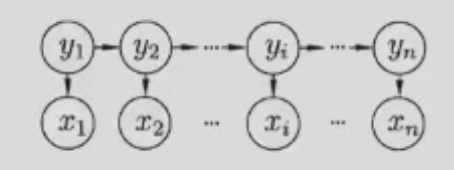

    

观测训练产生：
1. 设置 $t=1$，并根据初始状态概率$\pi$选择初始状态 $y_1$
2. 根据状态 $y_t$ 的概率分布和输出观测概率 B 选择观测变量取值 $x_t$
3. 根据状态 $y_t$ 的概率分布和状态转移概率 A 选择下一状态 $y_{t+1}$
4. 若 $t<T$，则 $t=t+1$，转步骤 2；否则结束

    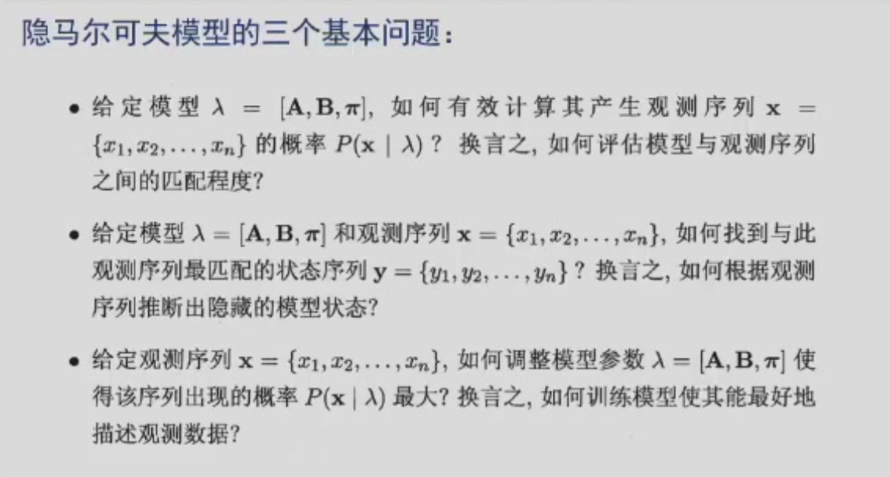

## 马尔可夫随机场
markov random field (MRF)

典型的马尔可夫网，这是一种著名的无向图模型。图中每个结点 表示一个或一组变量，结点之间的边表示两个变量之间的依赖关 系。马尔可夫随机场有二组势函数，亦称“因子”，这是定义在变 量子集上的非负实函数，主要用于定义概率分布函数。

    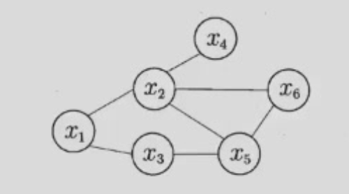

对于图中结点的一个子集，若其中任意两结点间都有边连接，则 称该结点子集为一个“ 团” 。 若在一个团中加入另外任何一个结点 都不再形成团，则称该团为“极大团”;换言之，极大团就是不能 被其他团所包含的团。

在马尔可夫随机场中，多个变量之间的联合概率分布能基于团分 解为多个因子的乘积，每个因子仅与一个团相关。联合概率P(X) 定义为

$$
P(x) = \frac{1}{Z} \prod_{Q\in C} \phi_Q(x_Q)
$$

基于极大团定义

    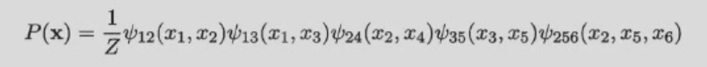

分离集:若从结点集 A 中的结点到 B 中的结点都必须经过结点集 C 中的结点，则称结点集 A 和 B 被结点集 C 分离

全局马尔可夫性:给定两个变量子集的分离集，则这两个变量子 集条件独立。

    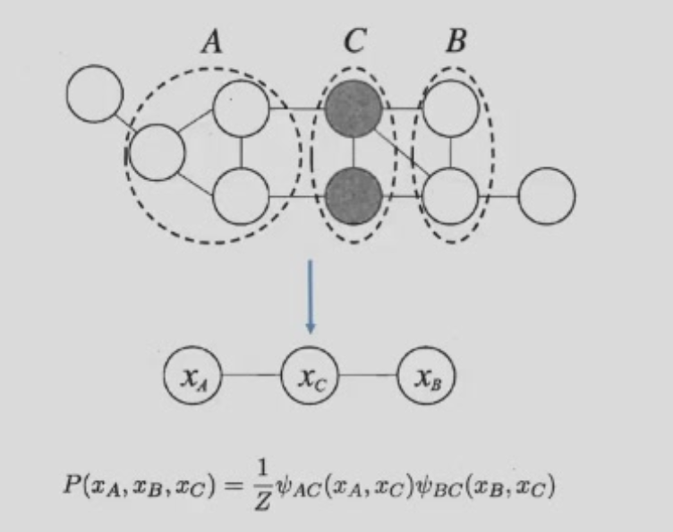

基于条件概率的定义可得：

$$
\begin{align*}
P(x_A, x_B \mid x_C) &= \frac{P(x_A, x_B, x_C)}{P(x_C)} = \frac{P(x_A, x_B, x_C)}{\sum_{x'_A} \sum_{x'_B} P(x'_A, x'_B, x_C)} \\
&= \frac{\frac{1}{Z} \psi_{AC}(x_A, x_C) \psi_{BC}(x_B, x_C)}{\sum_{x'_A} \sum_{x'_B} \frac{1}{Z} \psi_{AC}(x'_A, x_C) \psi_{BC}(x'_B, x_C)} \\
&= \frac{\psi_{AC}(x_A, x_C)}{\sum_{x'_A} \psi_{AC}(x'_A, x_C)} \cdot \frac{\psi_{BC}(x_B, x_C)}{\sum_{x'_B} \psi_{BC}(x'_B, x_C)}.
\end{align*}
$$

$$
\begin{align*}
P(x_A \mid x_C) &= \frac{P(x_A, x_C)}{P(x_C)} = \frac{\sum_{x'_B} P(x_A, x'_B, x_C)}{\sum_{x'_A} \sum_{x'_B} P(x'_A, x'_B, x_C)} \\
&= \frac{\sum_{x_B} \frac{1}{Z} \psi_{AC}(x_A, x_C) \psi_{BC}(x_B, x_C)}{\sum_{x'_A} \sum_{x'_B} \frac{1}{Z} \psi_{AC}(x'_A, x_C) \psi_{BC}(x'_B, x_C)} \\
&= \frac{\psi_{AC}(x_A, x_C)}{\sum_{x'_A} \psi_{AC}(x'_A, x_C)}.
\end{align*}
$$

因此我们有 $P(x_A,x_B|x_C)=P(x_A|x_C)P(x_B|x_C)$

推论：
+ 局部马尔可夫性:给定某变量的邻接变量，则该变量条件独立于其他变量
+ 成立对马尔可夫性:给定所有其他变量，两个非邻接变量条件独立

    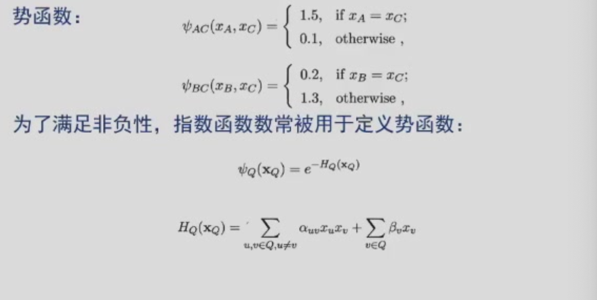

## 条件随机场

条件随机场试图对多个变量在给定观测值后的条件概率进行建模

若图 G 的每个变量 $y_v$ 都满足马尔可夫性，即

$$
P(y_v|x,y_{V\\{v\\}}) = P(y_v|x,y_{N(v)})
$$

则 $\(y,x\)$ 构成一个条件随机场

    

    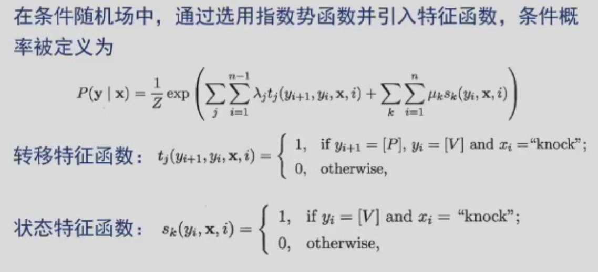

## 学习与推断

边际化：给定一个联合概率分布，将某些变量边际化掉，得到另一组变量的概率分布，求解某个变量的边缘概率，就是对其他无关概率作积分。

推断问题的目标是计算边际概率或条件概率

### 变量消去

变量消去就是对无关变量都做求和，将与之相关的项相加就得到了与之无关的项。

    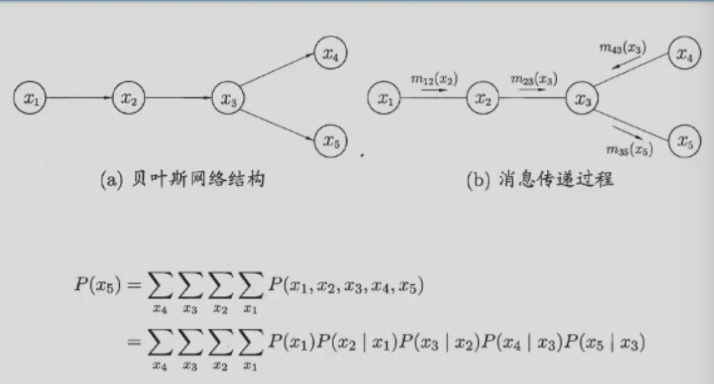

### 信念传播

信念传播算法将变量消去法中的求和操作看作一个消息传递过程， 较好地解决了求解多个边际分布时的重复计算问题。

在信念传播算法中，一个结点仅在接收到来自其他所有结点的消 息后才能向另 一个结点发送消息，且结点的边际分布正比于它所 接收的消息的乘积，即

$$
P(x_i) \propto \prod_{j\in N(i)} \mu_{j\to i}(x_i)
$$

若图结构中没有环，则信念传播算法经过两个步骤即可完成所有消息传递，进而能计算所有变量上的边际分布。
+ 指定一个根结点，从所有叶结点开始向根结点传递消息，直到根结点收到所有邻接结点的消息
+ 从根结点开始向叶结点传递消息，直到所有叶结点均收到消息

    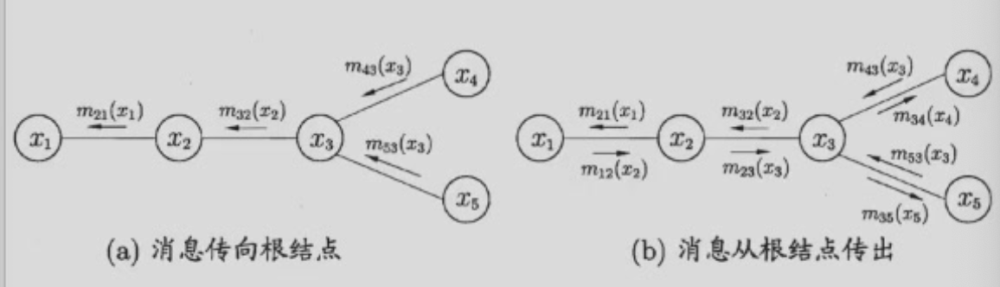

## 近似推断

+ 采样（sampling）使用随机化方法完成近似推断，如马尔可夫链蒙特卡罗法
+ 使用确定性近似完成近似推断，变分推断

### 蒙特卡罗法采样

假定目标是计算函数 $f(x)$ 的期望值，即

$$
E_p(f) = \int f(x) p(x) dx
$$

计算 $f(x)$ 在这些样本上的均值

$$
\hat{f} = \frac{1}{N}\sum_{i=1}^N f(x^{(i)})
$$

马尔可夫链的平稳分布：

$$
p(x^t)T(x^{t-1}|x^t) = p(x^{t-1})T(x^t|x^{t-1})
$$

Metropolis-Hastings 算法 (MH) 算法

    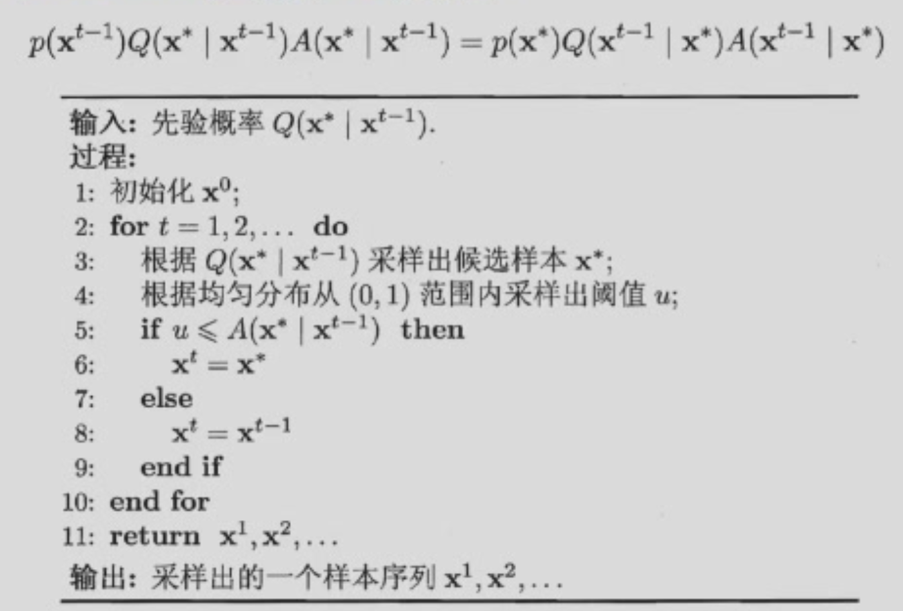

    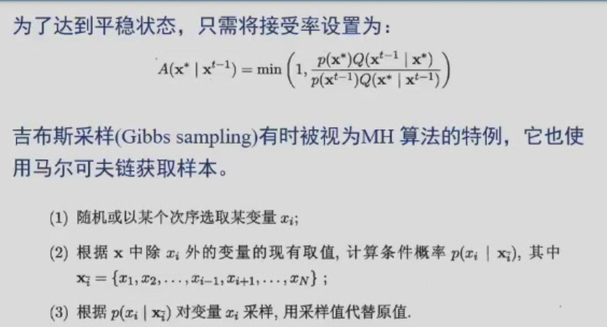

### 变分推断

+ 盘式记法

    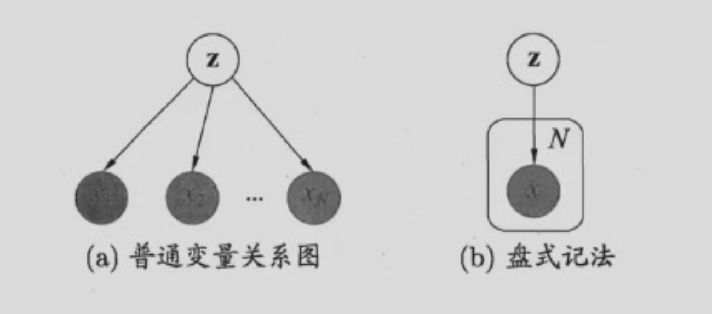

所有能观察到的变量x的联合分布的概率密度函数是

$$
p(x|\Theta) = \prod_{i=1}^n \sum_z p(x_i, z|\Theta)
$$

所对应的对数似然函数为

$$
\ln p(x|\Theta) = \sum_{i=1}^n \ln \sum_z p(x_i, z|\Theta)
$$

概率模型的参数估计通常以最大化对数似然函数为手段：

$$
\begin{aligned}
\Theta^{t+1} &= \argmax_{\Theta} Q(\Theta;\Theta^t)\\
&= \argmax_{\Theta} \sum_{z} p(z|x,\Theta^t) \ln p(x,z|\Theta)

## 话题模拟