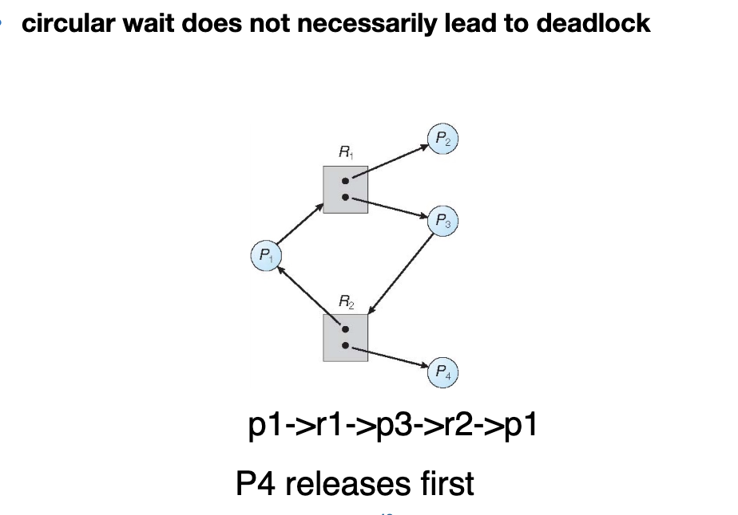
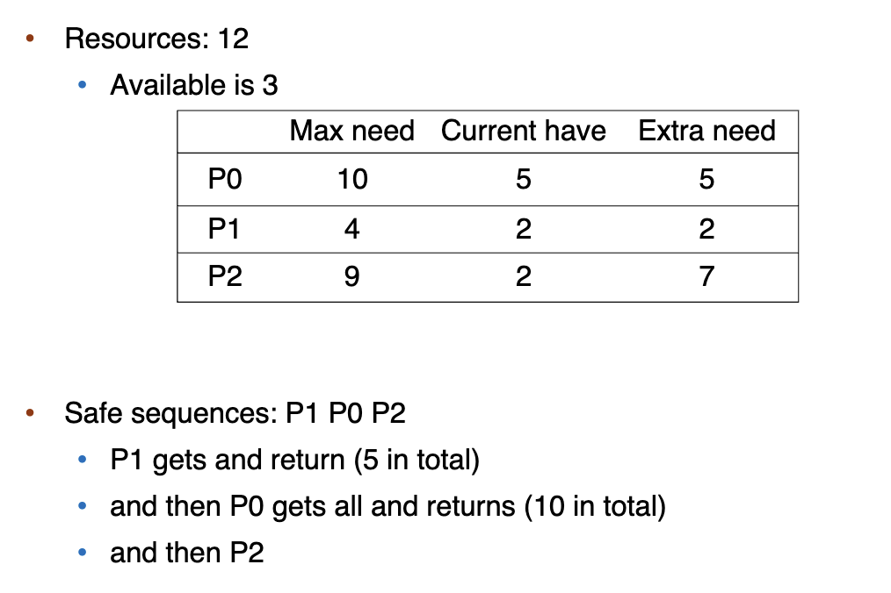
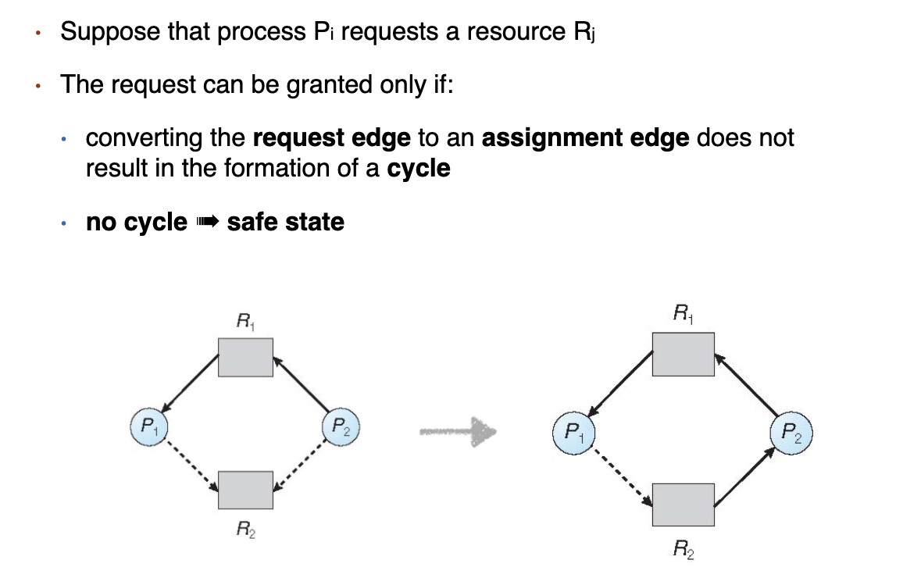

# Deadlock

## Deadlock problem

Deadlock problem: a set of block processes each holding a resource and waiting to acquire a resource held by another process in the set.

Note: most OSes do not prevent or deal with deadlocks.

Can be illustrated by a resource allocation graph.

## System Model of deadlock

+ Resources: each represents a different resource type e.g. CPU cycles, memory space, I/O devices
+ each resource type $R_i$ has $W_i$ instances
+ Each process utilizes a resource in the following pattern
  + request
  + use
  + release

### Four Conditions of Deadlock

1. Mutual exclusion: a resource can only be used by one process at a time.
2. Hold and wait: a process holding at least one resource is waiting to acquire additional resources held by other processes.
3. No preemption: a resource can be released only voluntarily by the process holding it, after it has completed its task.
4. Circular wait: there exists a set of waiting processes 

!!! example judge if deadlock
    

## How to handle deadlock

Ensure the system will never enter a deadlock state.

+ Prevention
+ Avoidance

Allow the system to enter a deadlock state and then recover.

+ Detection

Ignore the problem and pretend that deadlocks never occur in the system; used by most OSes.

### Deadlock Prevention

+ prevent mutual exclusion
  + not required for sharable resources
  + must hold for non-sharable resources
+ hold and wait
  + whenever a process requests a resource, it doesn’t hold any other resources
    + require process to request all its resources before it begins execution
    + allow process to request resources only when the process has none
      申请资源时不能有其他资源，要一次性申请所有需要的资源。
  + low resource utilization; starvation possible
    利用率低，而且可能有进程永远拿不到所有需要的资源，因此无法执行。
+ no preemption
  + 可以抢，但不实用。
+ circular wait
  + impose a total ordering of all resource types
  + require that each process requests resources in an increasing order of enumeration
  + many OSes adopt this strategy for some locks.

### Deadlock Avoidance

avoidance 用了一些算法，在分配资源之前，先判断是否会死锁，如果会死锁就不分配。

#### Safe State

序列里的每一个进程都可以被满足。（空闲的资源和之前的进程释放的资源）
Safe state can guarantee no deadlock.
Deadlock avoidance ensure a system never enters an unsafe state.

+ Single instance of each resource type : use resource allocation graph
+ Multiple instances of a resource type : use the Banker’s algorithm

!!! example Safe state
    

#### banker's algorithm

+ claim edge: 某个 process 可能需要 resource，用 dashed line 表示
+ 必须要先 claimed a priori in the system

+ Transitions in between states
  + claim edge converts to request edge when a process requests a resource
  + request edge converts to an assignment edge when the  resource is allocated to the process
  + assignment edge converts to claim edge when the process releases the resource

+ each process must claim maximum use of resources it may need in advance
+ when a process requests a resource, it may have to wait
+ when a process gets all its resources, it must return them in a finite amount of time

我们通过 available（当前还没有被分配的空闲资源）, max（进程所需要的资源）, allocation（已经分配的资源）, need（还需要分配多少资源） 这四个矩阵刻画一个时间内各个进程对各种资源的持有和需求情况。

选取一个 need（的每一项都对应地）小于 available（的对应项）的进程，其运行完后会将 allocation 释放回 work（前面的进程执行完毕后，空闲的资源），以此类推。事实上并不 work，因为并不知道需要多少资源。

## Deadlock Detection

用 process 做 node 画 wait-for graph，如果有环就有 deadlock。

## Deadlock Recovery

+ Terminate deadlocked processes options
  + abort all deadlocked processes
  + abort one process at a time until the deadlock cycle is eliminated
  + 如何选择哪个进程终止？
    + process priority
    + how long process has computed
    + how long process has been waiting
    + resources process has used
    + resources process needs to complete
    + is process interactive or batch

+ Resource preemption
  + select a victim
  + rollback to some safe state
  + restart processes