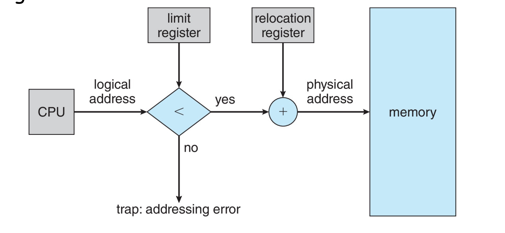
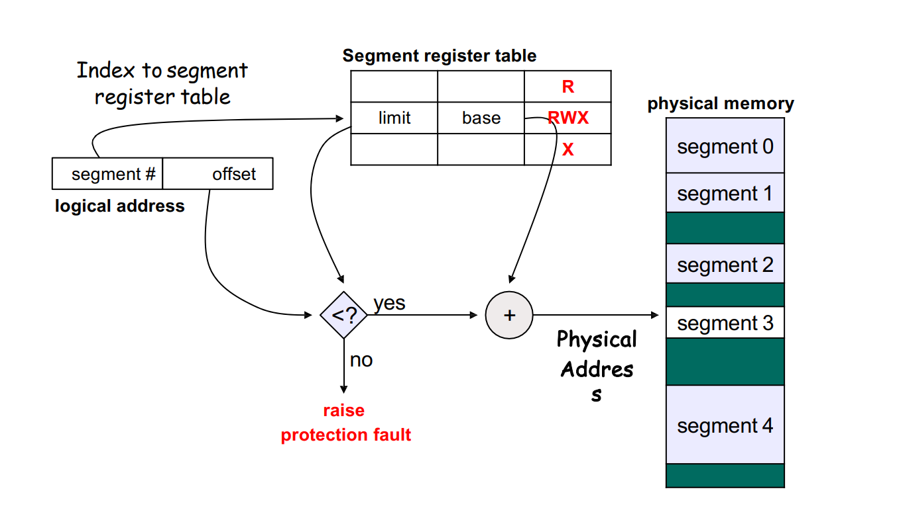
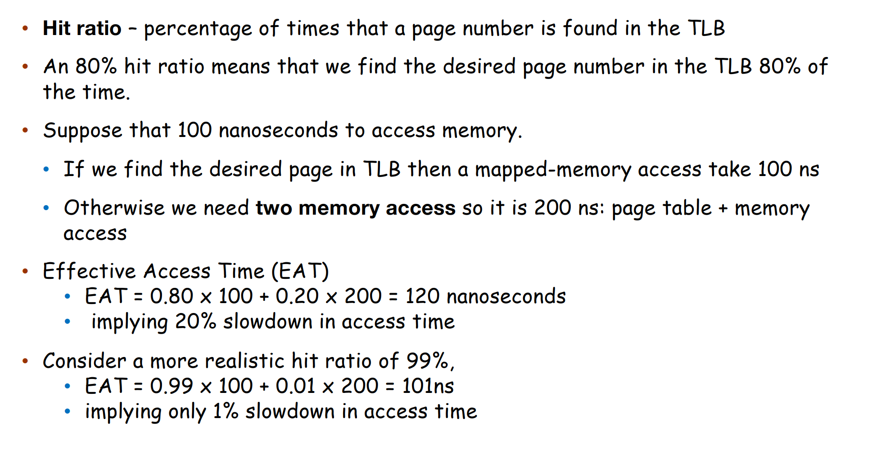

# Main Memory

## Problem

直接使用绝对物理地址会导致程序不可移动，当系统运行一段时间后，会导致内存空间的碎片化。

为了解决这个问题，如果把一个程序内部的所有地址都用相对地址，相对这个程序 start 的地址的 offset 的方式来表示，那么只需要挪动开始的地址，其他的地址都会自动的更新，这实现了移动。

logical address 逻辑地址就是我们看到的地址，当硬件使用时，硬件会把他加上 base 地址，得到实际的物理地址。每个 process 都有自己的 base, limit。每次进程切换时，OS 都会将 base 和 limit 寄存器的值更新为当前进程的值。（线程不需要，因为线程是共享的地址空间）

## Simplest Implementation - Partition

每次访问时检查是否超过了 Limit，如果是就说明越界了。

    

### Partitioning Strategies

+ Fixed

使用同样的 size，但是 size 要切多大？如果切的太小，可能有大进程无法加载进来；如果切的太大，会有内部碎片（因为在一个 partition 内部）。（Internal fragmentation）

+ Variable  

会有 external fragmentation，因为 partition 的大小不一样，可能会有一些小的 partition 无法被利用。

## Segmentation

第二次定义 logical address 

+ <segment-number, offset>
+ Offset is the address offset within the segment.
+ Segment table where each entry has:
+ Base: starting physical address
+ Limit: length of segment

利用 partition 的概念实现了 Segmentation 的机制。

认为 text、data、stack 是多个区域，每个区域就可以用一个 partition 来代表它。

根据 number 在 table 里找到对应的 base 和 limit，然后加上 offset 就得到了真正的物理地址。

    

一个 partition 只能有一个权限。这是一种 variable 的 partition，是因为 limit 可以任意的。但是没有解决外部碎片的问题。

## Address Binding

在程序的不同阶段，地址有不同的表现方式：
+ source code addresses are usually symbolic. (e.g., variable name)
+ compiler binds symbols to relocatable addresses. (e.g., “14 bytes from beginning of this module”)
+ linker (or loader) binds relocatable addresses to absolute addresses.

## MMU (Memory Management Unit)

## Paging

basic idea: 把物理地址和程序都切分。

+ Frame/帧 物理地址
+ Page/页 虚拟地址

page 会有的问题是 Internal fragmentation，因为 page size 是固定的，所以可能会有一些空间浪费。但是只有前面被填满了才会找最后一个，只有最后一级页表会被浪费，相对较小。

### Page Table

页表里存的是 frame number.页表不存页号（页号用作索引），只存物理帧号。

第三次定义 logical address <page number, page offset>
2-level <pgd number, pte number, page offset>

### Page Table Hardware

早期的想法用寄存器，但是问题也很明显：
+ 寄存器数量有限
+ Switch context 的时候所有都要切换过来
+ 每个页用一组寄存器实现，优势是非常快，但是缺点是寄存器数量有限，无法存储多的页表。（如 32 bit 地址，20 位作为物理页号，会有 
 个页）

所以现在用的 array，One big page table maps logical address to physical address

+ the page table should be kept in main memory
+ page-table base register (PTBR) points to the page table（PTBR 指向页表的起始地址。（RISC-V 上叫 SATP，ARM 上叫 TTBR，x86 上叫 CR3）存的是物理地址
+ page-table length register (PTLR) indicates the size of the page table

这样每次数据/指令访问需要两次内存访问，第一次把页表读出来，第二次再根据页表去读数据。解决方案是加 cache (TLB) translation lookaside buffer

### TLB

TLB (translation look-aside buffer) caches the address translation.
+ TLB hit: if page number is in the TLB, no need to access the page table.
+ TLB miss: if page number is not in the TLB, need to replace one TLB entry.
+ TLB usually use a fast-lookup hardware cache called associative memory.

Associative memory: memory that supports parallel search. If page# is in associative memory’s key, return frame# (value) directly.可以做并行搜索，TLB里面是乱序的，所以需要并行搜索。

与页表不同的是，TLB 里存储的既有 page number 又有 frame number，通过比较 page number 来找到对应的 frame number（相当于全相联的 cache）

+ TLB is usually small, 64 to 1024 entries.

TLB 数量有限，为了覆盖更大的区域，我们也想要把页变得更大。

每个进程有自己的页表，所以我们 context switch 时也要切换页表，要把 TLB 清空。
+ TLB must be consistent with page table
  + Option I: Flush TLB at every context switch, or,
  + Option II: Tag TLB entries with address-space identifier (ASID) that uniquely identifies a process.
    通用的全局 entries 不刷掉，把进程独有的 entries 刷掉。

    

!!! note Effective Access Time
    

        
    

### Memroy Protection

我们可以以页为粒度放上保护的一些权限（如可读、写、执行），这样就可以实现内存保护。

+ present/valid bit:present: the page has a valid physical frame, thus can be accessed
+ Each page table entry contains some protection bits
+ Any violations of memory protection result in a trap to the kernel

第四次 logical address <PGD number, PTE number, page offset>

### Inverted Page Table

Inverted page tables 索引 physical address 而不是 logical address，也就是说，整个系统只有一个页表，并且每个物理内存的 frame 只有一条相应的条目。寻址时，CPU 遍历页表，找到对应的 pid 和 page number，其在页表中所处的位置即为 frame number。

每次要遍历整个页表，效率低下。而且这样不能共享内存（因为一个物理帧只能映射到一个页）

### Swapping

+ Swapping extends physical memory with backing disks.
  + A process can be swapped temporarily out of memory to a backing store.
  + The process will be brought back into memory for continued execution.
+ Swapping is usually only initiated under memory pressure.
+ Context switch time can become very high due to swapping.

用 disk 备份内存（因为内存可能不够用），就把 frame 的值交换到 disk 上，然后把 frame 释放出来。当进程要执行的时候，再把 frame 从 disk 读回来。换回来时不需要相同的物理地址，但是逻辑地址要是一样的。

