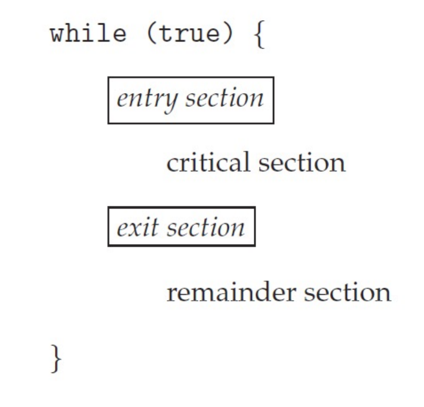
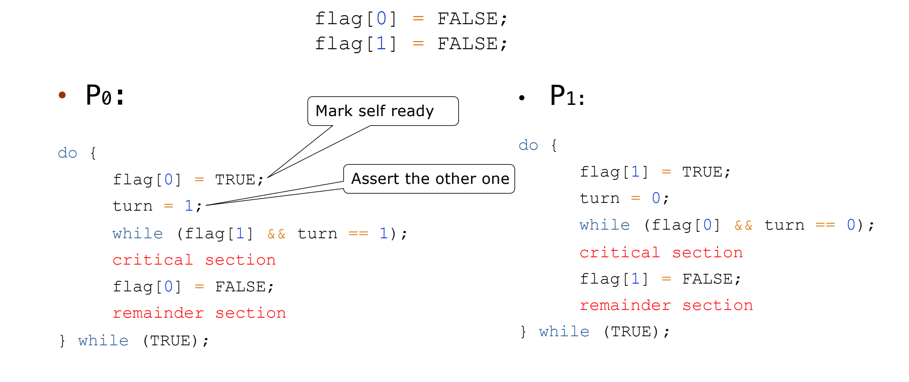
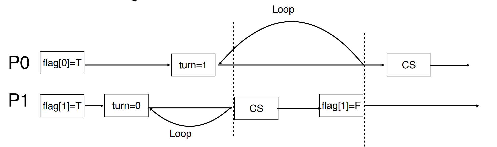

# Synchronization

## Race Condition

Several processes (or threads) access and manipulate the same data concurrently and the outcome of the execution depends on the particular order in which the access takes place, is called a race-condition.
多个进程并行地写数据，结果取决于写的先后顺序，这就是竞争条件。

kernel 里面 race 经常发生，在内核中，比如两个进程同时 fork，子进程可能拿到一样的 pid。

critical section

修改共同变量的区域称为 critical section；共同区域之前叫 entry section，之后叫 exit section。

+ Single-core system: preventing interrupts
+ Multiple-processor: preventing interrupts are not feasible (depending on if kernel is preemptive or non-preemptive)
  + Preemptive – allows preemption of process when running in kernel mode
  + Non-preemptive – runs until exits kernel mode, blocks, or voluntarily yields CPU

解决方案需要：
+ Mutual Exclusion（互斥访问）
  + 在同一时刻，最多只有一个线程可以执行临界区
+ Progress（空闲让进）
  + 当没有线程在执行临界区代码时，必须在申请进入临界区的线程中选择一个线程，允许其执行临界区代码，保证程序执行的进展
+ Bounded waiting（有限等待）
  + 当一个进程申请进入临界区后，必须在有限的时间内获得许可并进入临界区，不能无限等待

Perterson's Solution

It assumes that LOAD and STORE are atomic,(atomic: execution cannot be interrupted)

验证上面三个条件：
+ Mutual Exclusion
  + P0 enters CS:
    + Either `flag[1]=false` or `turn=0`
    + Now prove P1 will not be able to enter CS
  + Case 1: `flag[1]=false` P1 is out CS
  + Case 2: `flag[1]=true,` `turn=1` -> P0 is looping, contradicts with P0 is in CS
  + Case 3: `flag[1]=true`, `turn=0` -> P1 is looping
+ Process requirement

+ Bounded waiting

Whether P0 enters CS depends on P1; Whether P1 enters CS depends on P0; P0 will enter CS after one limited entry P1

Peterson’s Solution is not guaranteed to work on modern architectures.

+ Only works for two processes case
+ It assumes that LOAD and STORE are atomic
+ Instruction reorder
指令会乱序执行。

wait 和 signal 都要是 automatic 的，不能被打断。
linux 内 spinlock 用的多，很多操作都是很短的对一个变量操作。