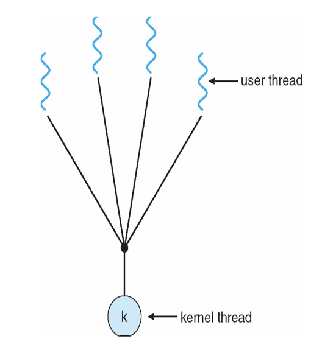

## Thread Definition
+ A thread is a basic unit of execution within a process 基本的执行单元
  + Each thread has its own
  + thread ID
  + program counter
  + register set
  + stack
+ It shares the following with other threads in the same process
  + code section
  + data section
  + the heap (dynamically allocated memory)
  + open files and signals
+ Concurrency: A multi-threaded process can do multiple things at once

+ Advantages of Threads
  + Responsiveness
  + Resource Sharing
  + Economy
  + Scalability
+ Drawbacks of Threads
  + 隔离性变差了，一个线程挂了整个进程都会挂
+ Typical challenges of multi-threaded programming

## User Threads vs. Kernel Threads

CPU + mode bit 分为 user mode 和 kernel mode。
现代的加两位，分为四种模式

+ Many-to-One Model
  + Advantages:multi-threading is efficient and low-overhead, 如果没有用 syscall 效率很高
  + Major Drawback:cannot take advantage of a multi-core architecture!if one threads blocks, then all the others do!只有一个 kernel thread，所以只能在一个核上运行，需要 syscall 的时候效率低



+ One-to-One Model
  + Removes both drawbacks of the Many-to-One Model
  + Creating a new threads requires work by the kernel
    + Not as fast as in the Many-to-One Model
  + Example:Linux, Windows, Solaris 9 and later 这种情况现在用的多是因为硬件便宜了，所以采用效率更高的方式


+ Many-to-Many Model
  + A compromise
  + If a user thread blocks, the kernel can create a new kernel threads to avoid blocking all user threads
  + A new user thread doesn’t necessarily require the creation of a new kernel thread
  + True concurrency can be achieved on a multi-core machine

+ Two-Level Model
  + The user can say: “Bind this thread to its own kernel thread”

## Thread Libraries

+ Thread libraries provide users with ways to create threads in their own programs
  + In C/C++: pthreads and Win32 threads
    + Implemented by the kernel
  + In C/C++: OpenMP(并行计算)
    + A layer above pthreadsfor convenient multithreading in “easy” cases
  + In Java: Java Threads
    + Implemented by the JVM, which relies on threads implemented by the kernel

只要符合接口的定义，就可以叫 pthreads。
+ Pthreads
  + May be provided either as user-level or kernel-level
  + A POSIX standard (IEEE 1003.1c) API for thread creation and synchronization
  + Specification, not implementation
  + API specifies behavior of the thread library, implementation is up to development of the library
  + Common in UNIX operating systems

+ OpenMP
  + Identifies parallel regions – blocks of code that can run in parallel
` #pragma omp parallel `
使用之后编译器会为我们切分出若干个并行块，创造出对应的线程，最后使用 join 把线程合并。

+ Java Threads
  + 最多用的，小白友好
  + Green threads have all the disadvantages of user-level threads
  + 早期 JVM 用的是 green threads(many-to-one)，现在提供了 native threads(one-to-one)

## Threading Issues
线程的加入让进程的操作变得更复杂。

### Semantics of `fork()` and `exec()`
Thread calls `fork()` 

+ Two possibilities:
  + A new process is created that has only one thread (the copy of the thread that called fork()), or
  + A new process is created with all threads of the original process (a copy of all the threads, including the one that called fork())
+ Linux use the first option

If one calls exec() after fork(), all threads are “wiped out” anyway

### Signals
We’ve talked about signals for processes
+ Signal handlers are either default or user-specified
+ signal() and kill() are the system calls
+ In a multi-threaded program, what happens?
  + Deliver the signal to the thread to which the signal applies
  + Deliver the signal to every thread in the process
  + Deliver the signal to certain threads in the process
  + Assign a specific thread to receive all signals
+ Most UNIX versions: a thread can say which signals it accepts and which signals it doesn’t accept
+ On Linux: dealing with threads and signals is tricky but well understood with many tutorials on the matter and man pages，交给开发者选择

### Safe Thread Cancellation 
把一个线程的工作取消掉，如何保证取消后不影响系统的稳定性。
+ One potentially useful feature would be for a thread to simply terminate another thread
+ Two possible approaches:
  + Asynchronous cancellation 立即终止。
    + One thread **immediately** terminates another
    + The terminated thread does not get to clean up after itself
    + The terminated thread does not get to unlock any mutexes it has locked
  + Deferred cancellation 线程会自己进行周期性检查，如果取消掉不会影响系统的稳定性，就把自己取消掉。
    + The thread is marked for cancellation
    + The thread periodically checks if it has been marked for cancellation
    + The thread can clean up and unlock mutexes before it terminates
    + The thread can refuse to be cancelled

Default type is deferred


+ The problem with asynchronous cancellation: 
  + 立即取消 may lead to an inconsistent state or to a synchronization problem if the thread was in the middle of "something important"
  + Absolutely terrible bugs lurking in the shadows

带来很多问题：比如一个线程正在写变量，值还没有同步到内存或者 cache，这个 bug 很难被复现。
如何 debug 这种问题？需要先复现 reproduce。

+ The problem with deferred cancellation: the code is cumbersome due to multiple cancellation points,代码不好看，很笨重
+ In Java, the Thread.stop() method is deprecated, and so cancellation has to be deferred 目前没有一个很理想的方案

### Thread scheduling

+ Distinction between user-level and kernel-level threads
+ When threads supported, threads scheduled, not processes
+ Many-to-one and many-to-many models, thread library schedules user-level threads to run on LWP
  + Known as process-contention scope (PCS) since scheduling competition is within the process 进程粒度调度，进程分配的时间都一样，每个线程竞争进程的时间
  + Typically done via priority set by programmer
+ Kernel thread scheduled onto available CPU is system-contention scope(SCS) –competition among all threads in system 线程粒度调度，每个线程分配的时间一样


### Linux Threads

+ In Linux, a thread is also called a light-weight process (LWP)
+ The clone() syscallis used to create a thread or a process，底下的一些参数告诉线程有哪些信心
  + Shares execution context with its parent
  + pthreadlibrary uses clone() to implement threads.


`clone()` 有一个参数 `CLONE_VM`，如果设置了这个参数，那么父子进程会共享内存，否则不会共享内存。

+ Linux does not distinguish between PCB and TCB
  + Kernel data structure: task_struct


Single-threaded process vs multi-threaded process


最开始线程创建时
```c
task_struct{
    pid_t pid;// thread ID
    stack;

    mm_struct
    files
}
```
后面的线程创建时只创建 pid，stack，剩余的都指向开始的线程，这就实现了共享。

后面的 PID 都是 leading Thread PID

一个进程里面有许多线程，task_struck 内有 thread_group 的 list_head，用来串起所有线程

线程是 16K(0x4000) 对齐的，是因为至少是 1 page(0x1000) 对齐，又因为 kernel 的原因是要 4 page 对齐。目的是为了减少碎片化空间。


### User thread to kernel thread mapping

Process = Thread + Address Space

+ One task in Linux
  + Same task_struct(PCB) means same thread
    + Also viewed as 1:1 mapping
    + One user thread maps to one kernel thread
    + But actually, they are the same thread
  + Can be executed in user space
    + User code, user space stack
  + Can be executed in kernel space
    + Kernel code, kernel space stack


user space stack 不固定，kernel space stack 固定大小 16k(Linux)。

+ One task
  + Can be a single-threaded process
    + One task_struct–PCB
    + PIDisthreadID
  + Can be a multi-threaded process
    + Multiple task_struct
    + PID 是 leading thread 的 PID
  + Can be executed in user space
    + User code, user space stack
  + Can be executed in kernel space
    + Such as calls a system call
    + Execution flow traps to kernel
    + Execute kernel code, use kernel space stack


