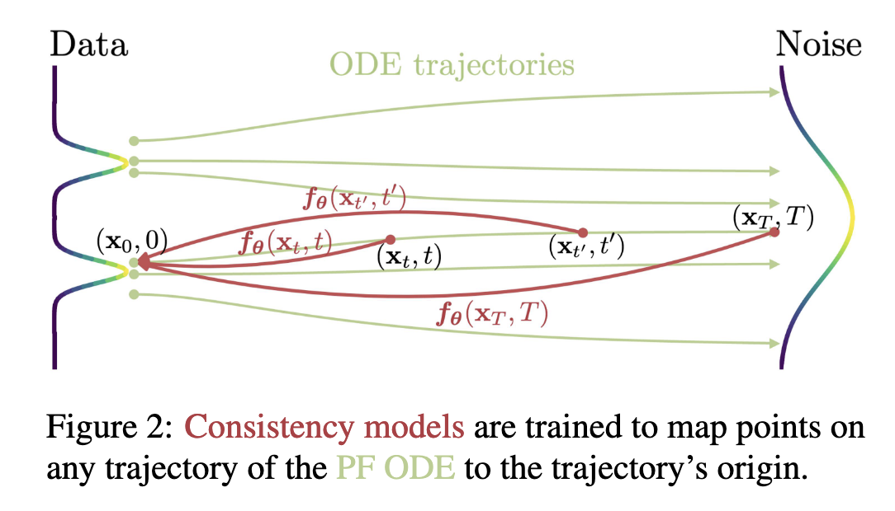
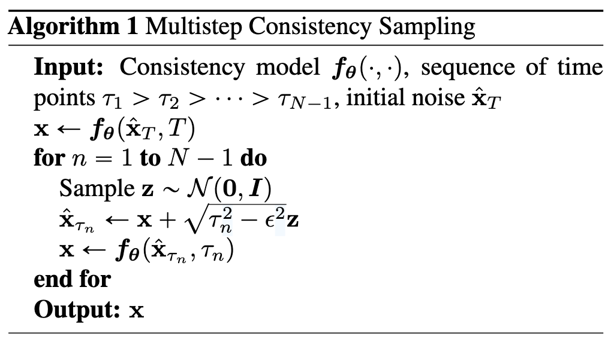
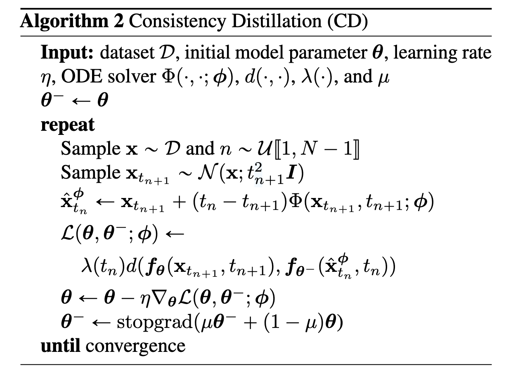

# Consistency Models
[Arxiv](https://arxiv.org/abs/2303.01469)
## Abstract

+ 问题：Diffusion 的效果很好，但是依赖于迭代采样过程，这使得生成缓慢
+ 解决：consistency Models--直接将噪声映射到数据来生成高质量的样本
+ idea: 通过 enforcing self-consistency property 来训练 consistency models；为什么能 single-step：满足 consistency property，在轨迹上任何一点都可以映射到初始点即原始的数据空间。

Consistency Model **既支持快速一步生成，也支持多步生成高质量样本**。They also support zero-shot data editing, such as image inpainting, colorization, and super-resolution, without requiring explicit training on these tasks.
既能用 single-step 生成样本，也能多次迭代来提高样本质量。

训练方式：从 pre-trained diffusion model 中 distill 或作为独立的生成模型训练

SOTA: in one-step and few-step sampling 优于存在的 distillation techniques; 
FID of 3.55 on CIFAR-10 and 6.20 on ImageNet 64 x 64 for one-step generation.

trained in isolation:outperform existing one-step, non-adversarial generative models on standard benchmarks such as CIFAR10, ImageNet 64 ˆ 64 and LSUN 256 ˆ 256.

## Introduction

扩散模型的一个关键特征是**迭代采样过程**，该过程逐渐从随机初始向量中消除噪声。这种迭代过程提供了计算和样本质量的灵活权衡，因为使用额外的计算进行更多次迭代通常会产生质量更好的样本。这也是许多 zero-shot editing 任务的基础，如图像修补、着色和超分辨率。然而相比于 GAN、VAE、nomalizing flow 等 single-step 生成模型，diffusion 模型的生成慢得多，通常需要 10-2000 倍的计算。

consistency model 保留原有的 more sample step, high-quality samples, and zero-shot editing 的能力，同时能实现 single-step 的快速生成。

为什么叫 consistency model：points on the same trajectory map to the same initial point。同一轨迹上的点映射到同一初始点

训练方法：based on enforcing the self-consistency property.

1. relies on numerical ODE solvers and a pre-trained diffusion model to generate pairs of adjacent points on a PF ODE trajectory
2. 作为独立的模型族训练。当作为独立生成模型进行训练时，一致性模型可以匹配或超越渐进蒸馏的一步样本的质量，尽管没有使用 pre-trained diffusion model。

两种训练方式都不需要对抗训练。也都对架构的约束很少，可以使用灵活的神经网络来参数化 consistency model。

数据集：CIFAR-10, ImageNet 64 x 64, LSUN 256 x 256

## Diffusion Models

扩散模型通过高斯扰动逐步将数据扰动为噪声来生成数据，然后通过顺序去噪步骤从噪声中创建样本。用 $p_{\text{data}}$ 代表数据分布，Diffusion model 从用SDE diffusing $p_{\text{data}}$ 开始：

$$
dx_t = \mu(x_t, t)dt + \sigma(x_t, t)dW_t
$$

其中 $W_t$ 是 Brownian motion，$\mu$ 是 drift coefficients，$\sigma$ 是 diffusion coefficients。将 $x_t$ 的分布表示为 $p_t(x)$，则有 $p_0(x) = p_{\text{data}}(x)$. 这个 SDE 的显著特征是存在一个称为概率流(probability Flow)的 ODE，其 solution trajectories sampled at t are distributed according to $p_t(x)$.

$$
dx_t = (\mu(x_t, t) - \frac{1}{2}\sigma^2(t)\nabla \log p_t(x_t))dt
$$

上面 SDE 的设计使得 $P_T(x)$ 接近于易处理的高斯分布 $\pi(x)$，也就是噪声。采用设置 $\mu(x,t) = 0,\sigma(t) = \sqrt{2t}$ 在这种设置下，我们有 $p_t(x) = p_0(x) \bigotimes \mathcal{N}(0,t^2I)$，其中 $\bigotimes$ 表示卷积。并且 $\pi(x) = \mathcal{N}(0,T^2I)$

对于 sampling，我们首先训练了一个 score model $s_\Phi(x,t) \approx \nabla\log p_t(x)$ 通过 score mathcing，然后将这个带入到上面的式子就得到 PF ODE 的 empirical estimate

$$
\frac{dx_t}{dt}=-ts_\Phi(x_t,t)
$$

这个式子被称为 empirical PF ODE。然后我们 sample $\hat{x}_T \sim \pi = \mathcal{N}(0,T^2I)$ 来初始化 empirical PF ODE 并使用任何数值 ODE 求解器及时向后求解，such as Euler and Heun solvers to obtain the solution trajectory. $\{\hat{x_T}\}_{t\in[0,T]}$，最后的结果 $\hat{x}_0$ 可以被看作原始数据的近似。To avoid numerical instability,一个常见的技巧是提早结束求解当 $t=\epsilon$, where $\epsilon$ is a small positive number. 把$\hat{x_\epsilon}$作为最终的样本。在这里设置 $\epsilon = 0.002,T=80$

Diffusion Model 受到采样速度的限制，显然使用 ODE 求解器采样需要对 score model $s_\Phi(x,t)$ 进行迭代评估，计算成本较高。现有的快速采样方法包括更快的数值 ODE 求解器和蒸馏技术。然而 ODE求解器仍然需要至少10个步骤来生成高质量的样本，而蒸馏技术依赖于在蒸馏之前从扩散模型中收集大量样本数据，这本身在计算上是昂贵的。只有 progressive distillation 的方法不受到这个缺陷的约束。

## Consistency Models

### Definition

给定 solution trajectory $\{x_t\}_{t\in[0,T]}$，定义 *consistency function* $f:(x_t,t) \longmapsto x_\epsilon$，一个 consistency function 有 *self-consistency* property 

!!! note Self-consistency
    对于任意 $t\in[0,T]$，$f(x_t,t) = x_\epsilon$ 对于 $(x_t,t)$ 属于同一个 PF ODE trajectory 是成立的。

The goal of consistency models , symbolized as $f_\theta$ , is to estimate this consistency function f from data by learning to enforce the self-consistency property 

### Parameterization

对任意 consistency function $f(\cdot,\cdot)$，我们有 $f(x_\epsilon,\epsilon) = x_\epsilon$，其中 $f(\cdot,\epsilon)$ 是恒等函数，我们把这个约束称为 boundary condition. 所有一致性模型都必须满足这个边界条件，因为它对于一致性模型的成功训练起着至关重要的作用。这个边界条件也是一致性模型最严格的架构约束。对基于深度神经网络的 consistency model，本文讨论了两种几乎免费实现此边界条件的方法。

假设有一个 free-form 深度神经网络 $F_\theta(x,t)$，输出与 $x$ 在同一个维度，第一个方法是简单的参数化这个神经网络：

$$
f_{\theta}(\mathbf{x}, t) = 
\begin{cases}
    \mathbf{x} & t = \epsilon \\
    F_{\theta}(\mathbf{x}, t) & t \in (\epsilon, T]
\end{cases}.
$$

The second method is to parameterize the consistency model using skip connections, that is

$$
f_{\theta}(\mathbf{x}, t) = c_{\text{skip}}(t)\mathbf{x} + c_{\text{out}}(t)F_{\theta}(\mathbf{x}, t),
$$
    
$c_{\text{skip}}(\mathbf{x}, t)$ 和 $c_{\text{out}}(t)$ 是可微函数满足 $c_{\text{skip}}(\epsilon) = 1$ 和 $c_{\text{out}}(\epsilon) = 0$。这种方法下，consistency model is differentiable at $t = \epsilon$,which is critical for training continuous-time consistency models.第二种参数化方法与许多成功的生成模型类似，使得更容易借用强大的扩散模型架构来构建一致性模型。因此，我们在所有实验中都遵循第二个参数化。

### Sampling

对一个 well-trained consistency model $f_\theta(\cdot,\cdot)$，我们可以从初始分布$\hat{x_T}\sim\mathcal{N}(0,T^2I)$中采样，然后 evaluating the consistency model for $\hat{x_\epsilon}=f_\theta(\hat{x_T},T)$。这里只包含了一次 forward pass，因此 *generates samples in a single step*.Importantly, one can also evaluate the consistency model multiple times by alternating denoising and noise injection steps for improved sample quality.这种多步采样过程提供了以计算换取样本质量的灵活性。它在zero shot editing 中也有重要的应用

!!! note FID
    FID 是基于弗里歇距离（Frechet Distance）的一种距离度量，用于比较两个高维分布之间的相似性。在图像生成任务中，这两个分布通常是：

        •	生成图像的特征分布（由生成模型生成的样本）。
        •	真实图像的特征分布（来自真实数据集的样本）。

在实验中，我们用贪心算法找到时间点 $\{\mathcal{T}_1,\mathcal{T}_2,\cdots,\mathcal{T}_{N-1}\}$，其中使用三元搜索(ternary search)一次精确定位一个时间点，以优化从算法 1 获得的样本的 FID。这假设给定先前时间点，FID 是下一个时间点的单峰函数。

上面算法就是反复去噪和注入噪声的过程，随着 n 增大，加的噪声越小

### Zero-Shot Data Editing

Consistency models 也可以用于 zero-shot data editing，they do not require explicit training to perform these tasks,例如，一致性模型定义从高斯噪声向量到数据样本的一对一映射。

## Training Consistency Models via Distillation

这种方法是基于 pre-trained diffusion model, 考虑将时间范围 $[\epsilon,T]$ 划分成 N-1 个字区间，边界 $t_1 = \epsilon < t_2 < \cdots < t_N = T$，这里定义 boundary 的方式遵循了 [这里的](https://arxiv.org/abs/2206.00364) 设置。 $t_i = \left( \epsilon^{1/\rho} + \frac{i - 1}{N - 1} \left( T^{1/\rho} - \epsilon^{1/\rho} \right) \right)^{\rho}$ 这里 $\rho = 7$。当 N 充分大时，我们可以通过运行数值 ODE solver 的一个离散化步骤来从 $x_{t_{n+1}}$ 获得 $x_{t_n}$ 的 accuracy estimate, $\hat{x}^\phi_{t_n}$，其定义是

$$
\hat{x}^\phi_{t_n}:= x_{t_{n+1}} + (t_{n} - t_{n+1})\Phi(x_{t_{n+1}},t_{n+1};\phi)
$$

其中 $\Phi(\cdots;\phi)$代表 update function of one-step ODE solver applied to the empirical PF ODE。

比如在用 Euler Solver 时，相应的 update rule 变成

$$
\hat{x}^\phi_{t_n} = x_{t_{n+1}} - (t_{n} - t_{n+1})s_\Phi(x_{t_{n+1}},t_{n+1})
$$

由于 PF ODE 和 SDE 之间的联系，我们可以首先采样 $x\sim p_{\text{data}}$ 然后将高斯噪声添加到 x 来沿 ODE trajectory 的分布进行采样。具体来说，给定 data point x, 我们可以高效地生成一对在 PF ODE 轨迹上的相邻点 $(\hat{x}^\phi_{t_n},x_{t_{n+1}})$，通过

+ 在数据集中采样 x
+ 从 the transition density of SDE $N(x,t^2_{n+1}I)$ 中采样 $x_{t_{n+1}}$ 
+ 通过上面的 one discretization step of the numerical ODE solver 生成 $\hat{x}^\phi_{t_n}$

接着，用这个 pair 与 模型输出之间的 difference 来训练 consistency model。

The consistency distillation loss is defined as

$$
\mathcal{L}_{CD}^N(\theta, \theta^- ; \phi) := \mathbb{E}\left[ \lambda(t_n) d\left(f_{\theta}(\mathbf{x}_{t_{n+1}}, t_{n+1}), f_{\theta^-}(\hat{\mathbf{x}}_{t_n}^{\phi}, t_n)\right) \right],
$$

这里的期望是关于 $x\sim p_{\text{data}},n\sim\mathcal{U}[1,N-1],x_{t_{n+1}}\sim\mathcal{N}(x;t^2_{n+1}I)$,$\lambda(\cdot)$是一个正权重函数。$\hat{\mathbf{x}}_{t_n}^{\phi}$ 是由前面的 ODE solver 生成的。$\theta^-$ 表示优化过程中过去 $\theta$ 值的运行平均值，$d(\cdot,\cdot)$ 是度量函数满足 $\forall\mathbf{x},\mathbf{y}:d(\mathbf{x},\mathbf{y})\geqslant0$ and $d(x,y) = 0$ if and only if $x=y$

$$
\theta^- \leftarrow \text{stopgrad}(\mu\theta^- + (1-\mu)\theta)
$$

根据深度学习的惯例，我们称 $f_{\theta^-}$ 为 "target network"， $f_{\theta}$ 为 "Online network",我们发现，与简单设置 $\theta^- = \theta$ 相比,EMA 更新和“stopgrad”算子,可以极大地稳定训练过程，提高一致性模型的最终性能

!!! note stopgrad
    在机器学习或深度学习中，stopgrad（通常表示 “stop gradient” 或 “detach”）用于阻止梯度的反向传播。这意味着计算图中的这一部分不会计算或传播梯度，即使在优化过程中也不会影响参数的更新。这种方法通常用于更新目标网络的参数（例如在深度强化学习中的目标网络更新），以使目标网络的参数逐步追随主网络的参数，而不干扰主网络的训练。

学习一致性函数的理论：

Let $\Delta t := \max_{n \in \llbracket 1, N-1 \rrbracket} \{ |t_{n+1} - t_n| \}$, and $\mathbf{f}(\cdot, \cdot; \phi)$ be the consistency function of the empirical PF ODE in Eq. (3). Assume $\mathbf{f}_{\theta}$ satisfies the Lipschitz condition: there exists $L > 0$ such that for all $t \in [\epsilon, T]$, $\mathbf{x}$, and $\mathbf{y}$, we have $\| \mathbf{f}_{\theta}(\mathbf{x}, t) - \mathbf{f}_{\theta}(\mathbf{y}, t) \|_2 \leq L \| \mathbf{x} - \mathbf{y} \|_2$. Assume further that for all $n \in \llbracket 1, N-1 \rrbracket$, the ODE solver called at $t_{n+1}$ has local error uniformly bounded by $O((t_{n+1} - t_n)^{p+1})$ with $p \geq 1$. Then, if $\mathcal{L}_{CD}^N(\theta, \theta^-; \phi) = 0$, we have

$$
\sup_{n, \mathbf{x}} \| \mathbf{f}_{\theta}(\mathbf{x}, t_n) - \mathbf{f}(\mathbf{x}, t_n; \phi) \|_2 = O((\Delta t)^p).
$$

这个定理说明了如果 consistency model 达到了 zero distillation loss，那么只要 step size sufficiently small，consistency model 任意精确。

## Training Consistency Models in Isolation

## CM Distillation