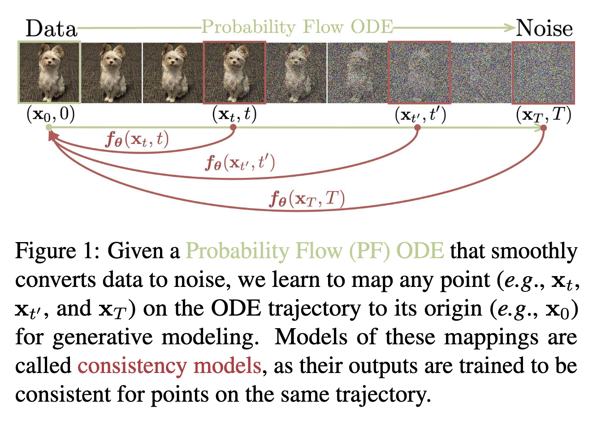

# Consistency Models
[Arxiv](https://arxiv.org/abs/2303.01469)
## Abstract

+ 问题：Diffusion 的效果很好，但是依赖于迭代采样过程，这使得生成缓慢
+ 解决：consistency Models--直接将噪声映射到数据来生成高质量的样本

Consistency Model **既支持快速一步生成，也支持多步生成高质量样本**。They also support zero-shot data editing, such as image inpainting, colorization, and super-resolution, without requiring explicit training on these tasks.
既能用 single-step 生成样本，也能多次迭代来提高样本质量。

训练方式：从 pre-trained diffusion model 中 distill 或作为独立的生成模型训练

SOTA: in one-step and few-step sampling 优于存在的 distillation techniques; 
FID of 3.55 on CIFAR-10 and 6.20 on ImageNet 64 x 64 for one-step generation.

trained in isolation:outperform existing one-step, non-adversarial generative models on standard benchmarks such as CIFAR10, ImageNet 64 ˆ 64 and LSUN 256 ˆ 256.

## Introduction

扩散模型的一个关键特征是**迭代采样过程**，该过程逐渐从随机初始向量中消除噪声。这种迭代过程提供了计算和样本质量的灵活权衡，因为使用额外的计算进行更多次迭代通常会产生质量更好的样本。这也是许多 zero-shot editing 任务的基础，如图像修补、着色和超分辨率。然而相比于 GAN、VAE、nomalizing flow 等 single-step 生成模型，diffusion 模型的生成慢得多，通常需要 10-2000 倍的计算。

consistency model 保留原有的 more sample step, high-quality samples, and zero-shot editing 的能力，同时能实现 single-step 的快速生成。

为什么叫 consistency model：points on the same trajectory map to the same initial point。同一轨迹上的点映射到同一初始点

训练方法：based on enforcing the self-consistency property.

1. relies on numerical ODE solvers and a pre-trained diffusion model to generate pairs of adjacent points on a PF ODE trajectory
2. 作为独立的模型族训练。当作为独立生成模型进行训练时，一致性模型可以匹配或超越渐进蒸馏的一步样本的质量，尽管没有使用 pre-trained diffusion model。

两种训练方式都不需要对抗训练。也都对架构的约束很少，可以使用灵活的神经网络来参数化 consistency model。

数据集：CIFAR-10, ImageNet 64 x 64, LSUN 256 x 256

## Diffusion Models

扩散模型通过高斯扰动逐步将数据扰动为噪声来生成数据，然后通过顺序去噪步骤从噪声中创建样本

## Consistency Models
## Training Consistency Models via Distillation
## Training Consistency Models in Isolation
## CM Distillation