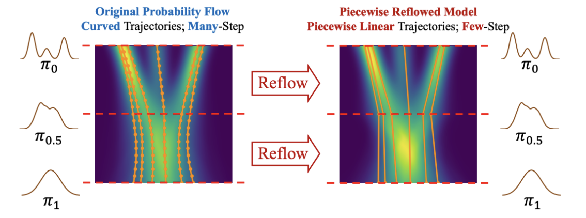

# PeRFlow

PeRFlow: Piecewise Rectified Flow as Universal Plug-andPlay Accelerator

[ArXiv](https://arxiv.org/pdf/2405.07510)

## Abstract

+ PeRFlow将生成流的采样过程划分为多个时间窗口，并通过回流操作拉直每个间隔内的轨迹，从而逼近分段线性流。
+ 在 few-step generation 取得 superior performance。
+ 通过 dedicated parameterizations，PeRFlow 模型继承了预训练扩散模型的知识。

## Introduction

+ 提出问题：diffusion 在 image,video,audio 上的生成效果很好，generate sample 通过 reversing pre-defined complicated diffusion processes，这一过程需要很多的 inference steps，这是很昂贵的。
+ 已经做的方法：
    + Solving the corresponding probability flow ordinary differential equation (PF-ODEs) 包括 DDIM, DPM-solvers, DEIS
    + Distilling pre-trained diffusion models into few-step generative models
        + Progressive Distillation 分割整个过程到很多小段，学习把每段起点映射到终点的过程
        + Distribution Matching Distillation and SwiftBrush 用 score distillation loss 来对齐两个分布
        + 也有用 adversarial 或/和 MSE losses 来对齐的，但是这要面临对抗性训练过程的 difficult tuning 和 mode collapse issue
        + LCM：仅用 pre-train 做监督，这增加了稳定性也更简单，但是相比对抗性的训练方法缺少细节。
+ 上面的方法主要学习从噪声到图像的映射，相当于跳过中间的 flow 过程，这很显然会更快。而我们的目标是简化流动轨迹并保留原始预训练扩散模型的连续流动轨迹
+ 先前涉及 flow 的方法包括 InstaFlow，思路是通过 reflow 的方法来拉直轨迹，问题在于 reflow 要求使用 ODE 求解器从 pre-trained diffusion model 中生成数据来构建数据集，这个过程需要大量的时间空间，其次，由于求解 OED 的数值误差，合成数据的质量不行。

## Method

### Rectified Flow and ReFlow

Flow-based generative models 目标是学习一个 velocity field $v_\theta(z_t,t)$，把 $z_1 \sim \pi_1$ 噪声，转化为 $z_0 \sim \pi_0$ 真实数据分布。那么，可以通过下面的 ODE 来描述这个过程：

$$
dz_t = v_\theta(z_t,t)dt,\quad z_1 \sim \pi_1
$$

最近，比较 popular 的方法是 simulation-free learning of flow-based models.其中有代表性的方法是 Rectified Flow，采用 noise distribution 和 data distirbution 之间的 linear interpolation.训练神经网络 $v_\theta$通过 conditional flow matching loss 来近似 velocity field.相应的优化称为 termed reflow.

$$
\min_\theta \mathbb{E}_{z_1\sim\pi_1,z_0\sim\pi_0}[\int_0^1\left|(z_1-z_0)-v_\theta(z_t,t)\right|^2dt],\quad \text{with} \quad z_t=(1-t)z_0+tz_1.
$$

InstaFlow 提出基于 reflow 加速预训练 diffusion-based text-to-image models.给定预训练 diffusion model $f_\phi$，sample 过程是解相应的 probability flow ODE(PFODE) 来表示。ODE solver 比如 DPM-Solvers，用 $\Phi(z_t,t,s)$，这里省略了参数。通过使用 $z_0=\Phi(z_1,1,0)$ 进行模拟，其中 $z_1$ 是从随机高斯分布 $\pi_1$ 中采样的，它合成了用于 reflow 的三元组数据集(text, image, noise)。由于通常需要数十个推理步骤才能用$\Phi(z_1,1,0)$生成高质量数据的 ，因此 scale up 的扩展成本很高。而且 InstaFlow 使用合成数据训练的，缺乏真实数据的监督，也是一个问题。

### Piecewise Rectified Flow

分段整流流的思想是