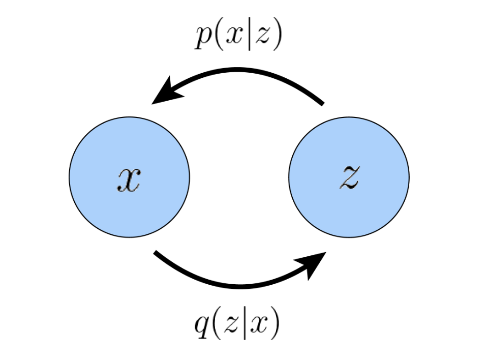
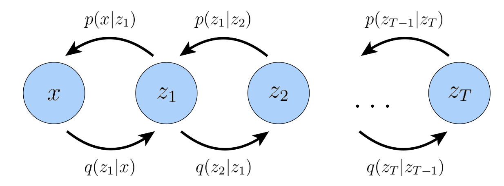
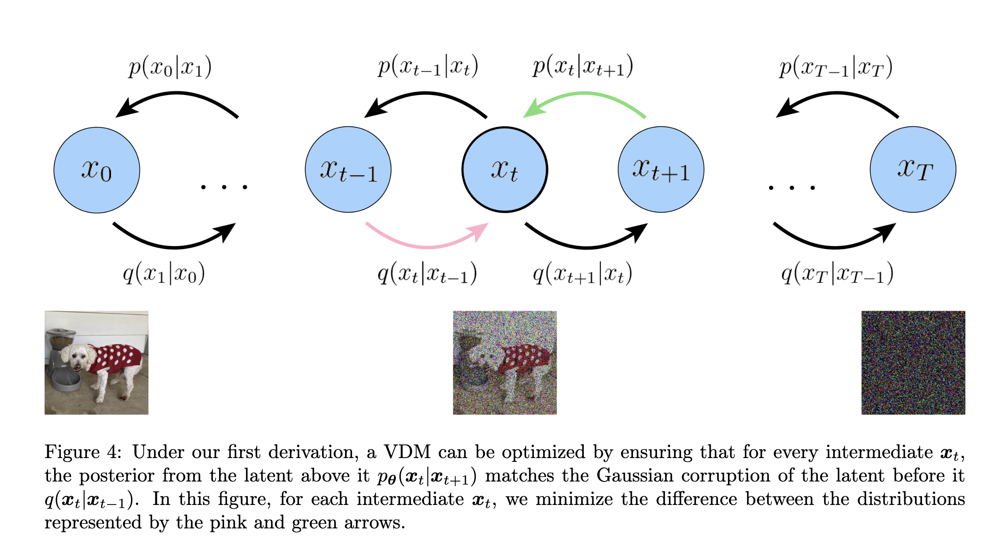

# Diffusion

## Latent

base assumption: the data/knowledge we learned can be represented by a high/low-dimensional latent space.
尽管这种变量不能被直观的观察到，我们仍可以描述和从中推断。

在尝试建模 latent 的过程中，存在建模高维还是低维数据的选择。大多数偏向其是低维的建模，原因是这是因为如果没有强大的先验知识，试图学习比观察更高维度的表示是徒劳的，另一方面是因为低维数据可以看作是一种压缩的表示，并且可以潜在地揭示描述观察结果的语义上有意义的结构。

## ELBO

ELBO means Evidence Lower Bound. It is a **lower bound** of the log likelihood of the data. It is used in variational inference to approximate the posterior distribution. 对 ELBO 的合理参数化和优化可以逼近实际的后验分布。

形式上定义为：

$$
\begin{aligned}
\text{ELBO}(\theta, \phi) = \mathbb{E}_{q_{\phi}(z|x)}[\log \frac{p_{\theta}(x, z)}{q_{\phi}(z|x)}]
\end{aligned}
$$

这里的 $p_{\theta}(x, z)$ 是 latent variable 与 data 的联合分布。 $q_{\phi}(z|x)$ 是 flexible approximate variational distribution，由 $\phi$ 参数化以寻求优化。

ELBO 可以看作是一个参数化的模型去评估在给定 observation $x$ 下的 latent variable $z$ 的分布。也就是说，它试图逼近真实的后验 $p(z|x)$。当这个逼近足够好的时候，我们就获得了真实数据的分布，然后就可以做各种推理来生成。

下面我们从数学角度来说明为什么 ELBO 是一个合适的优化对象。

$$
\begin{aligned}
\log p(x) &= \log \int p(x, z) dz \\
&= \log \int q_\phi(z|x) \frac{p(x, z)}{q_\phi(z|x)} dz \\
&= \log \mathbb{E}_{q_\phi(z|x)} \left[ \frac{p(x, z)}{q_\phi(z|x)} \right] \\
&\geq \mathbb{E}_{q_\phi(z|x)} \left[ \log \frac{p(x, z)}{q_\phi(z|x)} \right] \\
\end{aligned}
$$

最后一步是由 Jensen 不等式得到的。这里的 $\mathbb{E}_{q_\phi(z|x)} \left[ \log \frac{p(x, z)}{q_\phi(z|x)} \right]$ 就是 ELBO。

!!! note 期望
    随机变量$Z$ 在分布 $q(z)$ 下的期望表示为 $E_{q(z)}[f(Z)]=\int f(Z)q(z) dz$

但是通过 Jensen 不等式只是说明了 ELBO 是一个下界，但是没有说明为什么这个下界可以达到，适合去优化。于是我们可以通过 KL 散度来证明这一点。

!!! note KL 散度
    KL 散度是两个分布之间的差异度量。对于两个分布 $p(x)$ 和 $q(x)$，KL 散度定义为：
    $$
    D_\text{KL}(p||q) = \int p(x) \log \frac{p(x)}{q(x)} dx = E_{p(x)}[\log \frac{p(x)}{q(x)}]
    $$

$$
\begin{aligned}
\log p(x) &= \log p(x) \int q_\phi(z|x) dz \\
&= \int q_\phi(z|x) \log p(x) dz \\
&= \mathbb{E}_{q_\phi(z|x)}[\log p(x)] \\
&= \mathbb{E}_{q_\phi(z|x)}[\log \frac{p(x, z)}{p(z|x)}] \\
&= \mathbb{E}_{q_\phi(z|x)}[\log \frac{p(x, z)}{q_\phi(z|x)}] + \mathbb{E}_{q_\phi(z|x)}[\log \frac{q_\phi(z|x)}{p(z|x)}] \\
&= \mathbb{E}_{q_\phi(z|x)}[\log \frac{p(x, z)}{q_\phi(z|x)}] + D_\text{KL}(q_\phi(z|x) || p(z|x)) \\
&= \text{ELBO}(\theta, \phi) + D_\text{KL}(q_\phi(z|x) || p(z|x))\\
&\geq \text{ELBO}(\theta, \phi)
\end{aligned}
$$

在上面的推导中我们可以看到 KL 散度就是 evidence 与 ELBO 的差值，这说明 ELBO 确实是一个下界

这里我们希望得到的是真实的分布 $p(z|x)$，但是由于这个分布是不可解的，我们希望通过 $q_\phi(z|x)$来近似真实分布，这通过最小化 KL 散度来实现，但很难直接去做最小化。同时注意到的是我们的证据即对数似然是一个与 $\phi$ 无关的常数，所以通过$\phi$的最大化 ELBO 可以起到同样的效果。而当 ELBO 足够大的时候，我们就可以认为 $q_\phi(z|x)$ 逼近了真实的分布 $p(z|x)$。那么一旦得到了这个分布以后，我们就可以从中做推断，通过解码器 $p_\theta(x|z)$ 来生成数据。

## Variational Autoencoder (VAE)

在 default formulation of VAE, 我们直接最大化 ELBO.
+ variational，因为我们在由 $\phi$ 参数化的一系列潜在后验分布中寻找最优的参数 $\phi$ 来优化 $q_\phi(z|x)$。
+ autoencoder，因为输入数据在经历中间瓶颈表示步骤后被训练以预测自身

下面来进一步分析 ELBO：

$$
\begin{aligned}
\text{ELBO}(\theta, \phi) &= \mathbb{E}_{q_{\phi}(z|x)}[\log \frac{p_{\theta}(x, z)}{q_{\phi}(z|x)}] \\
&= \mathbb{E}_{q_{\phi}(z|x)}[\log p_{\theta}(x|z)] + \mathbb{E}_{q_{\phi}(z|x)}[\log \frac{p_{\theta}(z)}{q_{\phi}(z|x)}] \\
&= \mathbb{E}_{q_{\phi}(z|x)}[\log p_{\theta}(x|z)] - D_\text{KL}(q_{\phi}(z|x) || p_{\theta}(z))
\end{aligned}
$$

在这里，$q_\phi(z|x)$ 被视作 encoder，$p_\theta(x|z)$ 被视作 decoder。

the first term measures the reconstruction likelihood of the decoder from our variational distribution; this ensures that the learned distribution is modeling effective latents that the original data can be regenerated from. 第一项衡量的是变分分布测量解码器的重建可能性。这确保了学到的分布是在建模有效的潜在变量，原始数据可以从中再生。
The second term measures how similar the learned variational distribution is to a prior belief held over latent variables. 第二项衡量的是学到的分布与实际的分布（prior belief）的相似程度

从公式中我们可以看到，最大化 ELBO 的过程就是在最大化重建概率和最小化 KL 散度。

VAE 的一个决定性特征是如何对参数 $\phi$ 和 $\theta$ 联合优化 ELBO。有以下的定义：

$$
\begin{aligned}
q_\phi(z|x) &= \mathcal{N}(z; \mu_\phi(x), \sigma^2_\phi(x)I) \\
p(z) &= \mathcal{N}(z; 0, I) \\
\end{aligned}
$$

有了这两个定义，KL 散度项就可以计算了，重建项可以用蒙特卡洛测量来估计。我们的目标可以重写为：

$$
\begin{aligned}
& \argmax_{\phi,\theta} \mathbb{E}_{q_{\phi}(z|x)}[\log p_{\theta}(x|z)] - D_\text{KL}(q_{\phi}(z|x) || p_{\theta}(z)) \\
\approx & \argmax_{\phi,\theta} \frac{1}{L} \sum_{l=1}^L \log p_{\theta}(x|z^{(l)}) - D_\text{KL}(q_{\phi}(z|x) || p_{\theta}(z))
\end{aligned}
$$

这里的 $z^{(l)}$ 是从 $q_\phi(z|x)$ 中采样得到的，对于每一个 obserbation $x$ 都会采样 $L$ 个 $z$。然而这样的默认设置带来问题：计算损失的每个 z(l) 都是由随机采样过程生成的，该过程通常是不可微分的。为了解决这个问题，我们可以使用重参数化技巧当 $q_\phi(z|x)$ 被设计为对某些分布建模时。

!!! note reparameterization trick
    这个重参数方法是通过引入一个额外的噪声项 $\epsilon$ 来实现的，将随机变量转化为噪声的确定函数，这就允许我们通过梯度下降来优化非随机项。例如从正态分布 $x \sim \mathcal{N}(\mu, \sigma^2)$ 中采样，我们可以通过 $x = \mu + \sigma \epsilon$ 来实现，其中 $\epsilon \sim \mathcal{N}(0, 1)$。因此，通过重新参数化技巧，可以通过从标准高斯分布采样、按目标标准差缩放结果并按目标均值平移结果来执行任意高斯分布的采样。

在 VAE 中，我们可以通过以下方式来重参数化：这里 $z$ 被定义为输入 $x$ 和辅助噪声变量 $\epsilon$的确定性函数。

$$
\begin{aligned}
z &= \mu_\phi(x) + \sigma_\phi(x) \odot \epsilon \\
\epsilon &\sim \mathcal{N}(0, I)
\end{aligned}
$$

这里 $\odot$ 表示逐元素乘法。在这个表示下，可以根据需要计算梯度来优化 $\mu$ 和 $\theta$。

在训练了 VAE 后，可以通过在潜在空间中采样 $z$ 并通过解码器 $p_\theta(x|z)$ 来生成新的数据。当 latent space 的维度较低时，可能会到学习紧凑、有用的表示。此外，当学习到语义上有意义的潜在空间时，可以在将潜在向量传递到解码器之前对其进行编辑，以更精确地控制生成的数据。

## Hierarchical VAE

Hierarchical VAE 是 VAE 的一种扩展，它通过在潜在空间中引入多个层次的结构来提高建模能力。在这种结构中，每个层次的潜在变量都可以被视为对数据的不同抽象级别的表示，从而允许模型学习更复杂的数据分布。尽管对一般的 HVAE 来说，每个 latent variable 都可以以先前所有的 latent variable 为条件，但是在这里，我们考虑特殊情况——马尔可夫 VAE（ Markovian HVAE (MHVAE)）。这说明每个 latent variable 只依赖于前一个 latent variable。直观来说就是叠很多层的 VAE，每一层的输出作为下一层的输入。

数学上，MHVAE 的表示为：

$$  
\begin{aligned}
p(x,z_{1:T}) &= p(z_T)p_\theta(x|z_1) \prod_{t=2}^T p(z_{t-1}|z_{t}) \\
q_\phi(z_{1:T}|x) &= q_\phi(z_1|x) \prod_{t=2}^T q_\phi(z_t|z_{t-1})
\end{aligned}
$$

我们可以将 ELBO 推广为：

$$
\begin{aligned}
\text{ELBO}(\theta, \phi) &= \log \mathbb{E}_{q_{\phi}(z_{1:T}|x)}[\frac{p_{\theta}(x, z_{1:T})}{q_{\phi}(z_{1:T}|x)}] \\
&\geq \mathbb{E}_{q_{\phi}(z_{1:T}|x)}[\log \frac{p_{\theta}(x, z_{1:T})}{q_{\phi}(z_{1:T}|x)}]
\end{aligned}
$$

然后把上面的定义带入到 ELBO 中，我们可以得到：

$$
\mathbb{E}_{q_{\phi}(z_{1:T}|x)}[\log \frac{p_{\theta}(x, z_{1:T})}{q_{\phi}(z_{1:T}|x)}] = \mathbb{E}_{q_{\phi}(z_{1:T}|x)}\left[\log\frac{p(z_T)p_\theta{x|z_1}\prod_{t=2}^Tp_\theta(z_{t-1}|z_t)}{q_\phi(z_1|x)\prod_{t=2}^Tq_\phi(z_t|z_{t-1})}\right]
$$

当我们研究变分扩散模型时，这个目标可以进一步分解为可解释的组件。

## Variational Diffusion Models

一种最简单看待 Variational Diffusion Models(VDM) 的方式是将其看作有三个关键约束的 MHVAE。这三个约束是：

+ The latent dimension is exactly equal to the data dimension
+ The structure of the latent encoder at each timestep is not learned; it is pre-defined as a linear Gaussian model. In other words, it is a Gaussian distribution centered around the output of the previous timestep
+ The Gaussian parameters of the latent encoders vary over time in such a way that the distribution of the latent at final timestep T is a standard Gaussian

我们用 $x_t$ 表示真实数据采样和潜在变量，$t_0$ 表示 true data sample，$t\in[1,T]$ 表示相应的 latent。VDM 的先验与 HMVAE 相同，根据上面的定义可以写成：

$$
\begin{aligned}
q(x_{1:T}|x_0) = \prod_{t=1}^T q(x_t|x_{t-1})
\end{aligned}
$$

根据第二个假设，我们知道每一个 latent variable 分布是以其先前的分层 latent variable 为中心（期望是 latent variable）的高斯分布。每一步的 encoder（加噪过程）都是固定的，均值和标准差可以是预先定义的超参数，也可以作为参数被学习。这个过程的数学表示是：

$$
\begin{aligned}
\mu_t(x_t) = \sqrt{\alpha_t}x_{t-1}\\
\Sigma_t(x_t) = \sqrt{1-\alpha_t}I
\end{aligned}
$$

这个设计保证方差保持在相似的范围内，也就是说是 variance-preserving.（利用参数控制）

这里的重点是 $\alpha_t$ 可能是一个可学习的参数，随着时间步的增大而变化。

因此，数学上可以表示为

$$
q(x_t|x_{t-1})=\mathcal{N}(x_t;\sqrt{\alpha_t}x_{t-1},(1-\alpha_t)I)
$$

从第三个假设中可以知道，加噪过程的最终结果是将 latent 变为高斯噪声。那么 VDM 的联合分布可以写成：

$$
p(x_{0:T}) = p(x_T)\prod_{t=1}^T p_\theta(x_{t-1}|x_t)
$$

其中 $p(x_T) = \mathcal{N}(X_T;0,I)$

这组假设描述的是图像输入随时间的稳定噪声；我们通过添加高斯噪声逐渐破坏图像，直到最终它变得与纯高斯噪声完全相同。

注意到我们的 encoder 不再通过 $\phi$ 参数化，而是完全由在每一时间步的有预定义的均值与方差的高斯分布建模。因此，在 VDM 中，我们只关注去噪过程，即 $p_\theta(x_{t-1}|x_t)$ 在优化 VDM 后，采样过程就很简单了，只需要迭代运行 T 个步骤的去噪转换即可。与任何的 HVAE 一样，VDM 也可以通过最大化 ELBO 进行优化。

$$
\begin{aligned}
\log p(x) &\geq \mathbb{E}_{q(x_{1:T}|x_0)}[\log \frac{p(x_{0:T})}{q(x_{1:T}|x_0)}]\\
&= \mathbb{E}_{q(x_{1:T}|x_0)}[\log\frac{p(x_T)\prod_{t=1}^Tp_\theta(x_{t-1}|x_t)}{\prod_{t=1}^Tq(x_t|x_{t-1})}]\\
&= \mathbb{E}_{q(x_{1:T}|x_0)}[\log\frac{p(x_T)p_\theta(x_0|x_1)\prod_{t=1}^{T-1}p_\theta(x_{t}|x_{t+1})}{q(x_T|x_{T-1})\prod_{t=1}^{T-1}q(x_t|x_{t-1})}]\\
&= \mathbb{E}_{q(x_{1:T}|x_0)}[\log\frac{p(x_T)p_\theta(x_0|x_1)}{q(x_T|x_{T-1})}] + \mathbb{E}_{q(x_{1:T}|x_0)}[\sum_{t=1}^{T-1}\log\frac{p_\theta(x_{t}|x_{t+1})}{q(x_t|x_{t-1})}]\\
&= \mathbb{E}_{q(x_{1:T}|x_0)}[\log p_\theta(x_0|x_1)]+\mathbb{E}_{q(x_{1:T}|x_0)}[\log\frac{p(x_T)}{q(x_T|x_{T-1})}] + \sum_{t=1}^{T-1}\mathbb{E}_{q(x_{1:T}|x_0)}[\log\frac{p_\theta(x_{t}|x_{t+1})}{q(x_t|x_{t-1})}]\\
&= \mathbb{E}_{q(x_{1}|x_0)}[\log p_\theta(x_0|x_1)]+\mathbb{E}_{q(x_{T-1},x_T|x_0)}[\log\frac{p(x_T)}{q(x_T|x_{T-1})}] + \sum_{t=1}^{T-1}\mathbb{E}_{q(x_{t-1},x_{t},x_{t+1}|x_0)}[\log\frac{p_\theta(x_{t}|x_{t+1})}{q(x_t|x_{t-1})}]\\
&= \mathbb{E}_{q(x_{1}|x_0)}[\log p_\theta(x_0|x_1)] - \mathbb{E}_{q(x_{T-1}|x_0)}[D_{KL}(q(x_T|x_{T-1})||p(x_T))] \\
& - \sum_{t=1}^{T-1}\mathbb{E}_{q(x_{t-1},x_{t+1}|x_0)}[D_{KL}(q(x_t|x_{t-1})||p_\theta(x_{t}|x_{t+1})]]
\end{aligned}
$$

这里的第一项是重建项，与之前类似。
第二项是先验匹配项，当最终的潜在分布与高斯先验匹配时，它会被最小化。该项不需要优化，因为它没有可训练的参数；此外，由于我们假设 T 足够大，使得最终分布呈高斯分布，因此该项实际上变为零。
第三项是一致性项。它努力使得 $x_t$ 的分布在前向和后向的过程中保持一致。

由于我们必须在所有的 timestep 上进行优化，优化 VDM 的成本主要由第三项决定。

然而，这样得到的 ELBO 可能不是最优的，因为一致性项的计算是通过两个随机变量 $x_{t-1},x_{t+1}$ 来计算的，这样得到的方差可能比只用一个随机变量计算的方差要大。在累积了 $T-1$ 个时间步以后，得到的方差可能会很大。因此，我们可以通过引入一个额外的约束来减小这个方差。$q(x_t|x_{t-1})=q(x_t|x_{t-1},x_0)$，由于马尔可夫性质，额外的条件项是多余的，那么根据贝叶斯法则，我们可以得到：

$$
\begin{aligned}
q(x_t|x_{t-1},x_0) &= \frac{q(x_{t-1}|x_t,x_0)q(x_t|x_0)}{q(x_{t-1},x_0)}
\end{aligned}
$$

有了这个新的约束，我们可以得到一个更好的 ELBO：这中间添加的 $q(x_{t-1}|x_t,x_0)$ 可以消去推导过程中的一些量，最后的结果是

$$
\begin{aligned}
& \mathbb{E}_{q(x_{1}|x_0)}[\log p_\theta(x_0|x_1)] - D_{KL}(q(x_T|x_{0})||p(x_T)) \\
& - \sum_{t=2}^{T}\mathbb{E}_{q(x_{t}|x_0)}[D_{KL}(q(x_{t-1}|x_{t},x_0)||p_\theta(x_{t-1}|x_{t})]]
\end{aligned}
$$

第二项可以重新解释为最终噪声输入的分布与标准高斯先验的接近程度
第三项可以重新解释为每个去噪步骤的一致性，我们学习所需的去噪转换步骤 $p_\theta(x_{t−1}|x_t)$ 作为易于处理的、真实的去噪转换步骤 $q(x_{t−1}|x_t, x_0)$ 的近似值。$q(x_{t−1}|x_t, x_0)$ 可以充当 ground truth signal。这一项当学习到的去噪声过程与真实的去噪声过程一致时，会被最小化。

由于同时学习编码器增加了复杂性，因此最小化任意复杂马尔可夫 HVAE 中的任意后验分布，每个 KL 散度项很难最小化，在 VDM 中我们可以利用高斯转移假设来使优化变得容易处理：

$$
q(x_{t-1}|x_t,x_0) = \frac{q(x_t|x_{t-1},x_0)q(x_{t-1}|x_0)}{q(x_{t}|x_0)}
$$

在这里，我们已经知道 $q(x_t|x_{t-1},x_0)=\mathcal{N}(x_t;\sqrt{\alpha_t}x_{t-1},(1-\alpha_t)I)$，所以我们只需要 $q(x_{t-1}|x_0)$ 和 $q(x_{t}|x_0)$。这里可以利用之前提到的重参数化技巧，从 $x_t \sim q(x_t|x_{t-1})$ 中采样

$$
x_t = \sqrt{\alpha_t}x_{t-1} + \sqrt{1-\alpha_t}\epsilon_t
$$

同样的，可以从 $x_{t-1} \sim q(x_{t-1}|x_{t-2})$ 中采样

$$
x_{t-1} = \sqrt{\alpha_{t-1}}x_{t-2} + \sqrt{1-\alpha_{t-1}}\epsilon_{t-1}
$$

因此，可以通过递归这一操作得到 $x_t \sim q(x_t|x_0)$

$$
\begin{aligned}
x_t &= \sqrt{\alpha_t}x_{t-1} + \sqrt{1-\alpha_t}\epsilon^*_{t-1}    \\
&= \sqrt{\alpha_t}(\sqrt{\alpha_{t-1}}x_{t-2} + \sqrt{1-\alpha_{t-1}}\epsilon^*_{t-2}) + \sqrt{1-\alpha_t}\epsilon^*_{t-1} \\
&=\sqrt{\alpha_t\alpha_{t-1}}x_{t-2} + \sqrt{\sqrt{\alpha_t-\alpha_t\alpha_{t-1}}^2+\sqrt{1-\alpha_t}^2}\epsilon_{t-2}\\
&= \sqrt{\alpha_t\alpha_{t-1}}x_{t-2} + \sqrt{1-\alpha_t\alpha_{t-1}}\epsilon_{t-2} \\
&= ... \\
& = \sqrt{\prod_{i=1}^{t}\alpha_i}x_0 + \sqrt{1-\prod_{i=1}^{t}\alpha_i}\epsilon_0 \\ 
& = \sqrt{\bar{\alpha}_t}x_0 + \sqrt{1-\bar{\alpha}_t}\epsilon_0 \\
& \sim \mathcal{N}(x_t;\sqrt{\bar{\alpha}_t}x_0,\sqrt{1-\bar{\alpha}_t}I)
\end{aligned}
$$

中间用到了所有的噪声都是独立同分布的，利用了高斯分布的特性。

现在我们已经得到了前面贝叶斯形式的去噪过程所需要的全部项，现在来推导最后的去噪声过程

因此，我们证明了在每一步中 $x_{t-1}\sim q(x_{t-1}|x_t,x_0)$ 呈正态分布，其中均值 $\mu_q(x_t,x_0)$ 是 $x_t$ 和 $x_0$ 的函数，方差 $\Sigma_q(t)$ 是 $\alpha$ 系数。这些 $\alpha$ 系数是已知的并且在每个时间步都是固定的；它们要么在建模为超参数时永久设置，要么被视为试图对其建模的网络的当前推理输出。

这里两个关键的参数是

$$
\mu_q(x_t,x_0) = \frac{\sqrt{\alpha_t(1-\overline{\alpha_{t-1}})x_t}+\sqrt{\overline{\alpha_{t-1}}}(1-\alpha_t)x_0}{1-\overline{\alpha_t}} 
$$

$$
\sigma_q(t)^2 = \frac{(1-\alpha_t)(1-\overline{\alpha_{t-1}})}{1-\overline{\alpha_{t}}}
$$

从两个正态分布的 KL 散度的变换出发：

$$
\begin{aligned}
& \argmin_\theta D_{\text{KL}}(q(x_{t-1}|x_t,x_0)||p_\theta(x_{t-1}|x_t)) \\
&= \argmin_\theta \frac{1}{2}(\log\frac{|\Sigma_{p_\theta}|}{|\Sigma_q|} - d + \text{tr}(\Sigma_{p_\theta}^{-1}\Sigma_q) + (\mu_{p_\theta}-\mu_q)^T\Sigma_{p_\theta}^{-1}(\mu_{p_\theta}-\mu_q)) \\
&= \arg \min_{\theta} \frac{1}{2 \sigma_q^2(t)} \left\| \mu_\theta - \mu_q \right\|_2^2
\end{aligned}
$$

这里 $\mu_q = \mu_q(x_t,x_0),\mu_\theta=\mu_\theta(x_t,t)$

根据前面的推导，我们可以将 $\mu_\theta(x_t,t)$ 设置成下面的形式来逼近 $\mu_q(x_t,x_0)$

$$
\begin{aligned}
\mu_\theta(x_t,t)=\frac{\sqrt{\alpha_t}(1-\overline{\alpha_{t-1}})x_t+\sqrt{\overline{\alpha_{t-1}}}(1-\alpha_t)\hat{x_\theta}(x_t,t)}{1-\overline{\alpha_{t}}}
\end{aligned}
$$

这里 $\hat{x_\theta}(x_t,t)$ 是由神经网络参数化的，这个神经网络的寻求从噪声图像 $x_t$ 和时间步骤 $t$ 预测 $x_0$

那么对 KL 散度的优化可以转化为

$$
\begin{aligned}
& \argmin_\theta D_{\text{KL}}(q(x_{t-1}|x_t,x_0)||p_\theta(x_{t-1}|x_t)) \\
& = \arg \min_{\theta} \frac{1}{2 \sigma_q^2(t)} \frac{\overline{\alpha_{t-1}}(1-\alpha_t)^2}{(1-\overline{\alpha_{t}})^2}[\left\|\hat{x_\theta}(x_t,t)-x_0\right\|^2_2]
\end{aligned}
$$

此外，最小化我们导出的 ELBO 目标在所有噪声水平上的求和项可以通过最小化所有时间步长的期望来近似：

$$
\argmin_\theta \mathbb{E}_{t\sim U{2,T}}[\mathbb{E}_{q(x_t|x_0)}[D_{\text{KL}}(q(x_{t-1}|x_t,x_0)||p_\theta(x_{t-1}|x_t))]]
$$

然后可以使用随时间步长的随机样本进行优化。

## Learning Diffusion Noise parameters

一个可能的方式是通过以 $\eta$ 参数化的神经网络 $\hat{\alpha}_\eta(t)$ 来预测 $\alpha_t$。但是为了计算 $\bar{\alpha}_t$，需要在每一个 timestep 做一些推断，这是低效的。尽管可以用缓存的方式来提高效率，我们也可以从数学的方式改进公式。

将先前得到的 $\sigma_q^2(t)$ 带入目标，我们得到：

$$
\begin{aligned}
&\frac{1}{2 \sigma_q^2(t)} \frac{\overline{\alpha_{t-1}}(1-\alpha_t)^2}{(1-\overline{\alpha_{t}})^2}[\left\|\hat{x_\theta}(x_t,t)-x_0\right\|^2_2] \\
&=\frac{1}{2\frac{(1-\alpha_t)(1-\overline{\alpha_{t-1}})}{1-\overline{\alpha_{t}}}}\frac{\overline{\alpha_{t-1}}(1-\alpha_t)^2}{(1-\overline{\alpha_{t}})^2}[\left\|\hat{x_\theta}(x_t,t)-x_0\right\|^2_2]\\
&=\frac{1}{2}\left(\frac{\overline{\alpha_{t-1}}}{1-\overline{\alpha_{t-1}}}-\frac{\overline{\alpha_{t}}}{1-\overline{\alpha_{t}}}\right)[\left\|\hat{x_\theta}(x_t,t)-x_0\right\|^2_2]
\end{aligned}
$$

!!! note SNR
    SNR means signal-to-noise ratio $\text{SNR}=\frac{\mu^2}{\sigma^2}$

根据前面的推导，$q(x_t|x_0) \sim \mathcal{N}(x_t;\sqrt{\overline{\alpha_t}}x_0,(1-\overline{\alpha_t})I)$ 那么我们就可以写出 

$$
\text{SNR}(t) =\frac{\overline{\alpha_{t}}}{1-\overline{\alpha_{t}}}
$$

那么前面的公式就可以转化为

$$
\begin{aligned}
&\frac{1}{2}\left(\frac{\overline{\alpha_{t-1}}}{1-\overline{\alpha_{t-1}}}-\frac{\overline{\alpha_{t}}}{1-\overline{\alpha_{t}}}\right)[\left\|\hat{x_\theta}(x_t,t)-x_0\right\|^2_2] \\
&=\frac{1}{2}(\text{SNR}(t-1)-\text{SNR}(t))[\left\|\hat{x_\theta}(x_t,t)-x_0\right\|^2_2]
\end{aligned}
$$

顾名思义，SNR 表示原始信号与存在的噪声量之间的比率；较高的 SNR 表示较多的信号，较低的 SNR 表示较多的噪声。在扩散模型中我们要求SNR随着时间步t的增加而单调减小；这形式化了这样一个概念：受扰动的输入 $x_t$ 随着时间的推移变得越来越嘈杂，直到它在 $t = T$ 时变得与标准高斯相同。

根据前面的推导，我们可以使用神经网络直接参数化每个时间步的 SNR，并与扩散模型一起联合学习。由于 SNR 必须随时间单调下降，我们可以将其表示为：

$$
\text{SNR}(t) = \exp(-\omega_\eta(t))
$$

其中 $\omega_\eta(t)$ 被建模为参数为 $\eta$ 的单调递增神经网络。那么$\overline{\alpha_t}$ 有一个优雅的形式

$$
\begin{aligned}
\overline{\alpha_t} = \text{sigmoid}(-\omega_\eta(t)) \\
1-\overline{\alpha_t} = \text{sigmoid}(\omega_\eta(t))
\end{aligned}
$$

## Three Equivalent Interpretations

正如我们之前证明的，可以通过简单地学习神经网络来训练变分扩散模型，以从任意噪声版本 $x_t$ 及其时间索引 $t$ 预测原始自然图像 $x_0$。而 $x_0$ 有另外两种参数化方法，可以推出 VDM 的两个等价解释。

在前面的推导中，利用重参数方法，我们可以用 $x_t$ 和噪声表示 $x_0$，即

$$
x_0 = \frac{x_t - \sqrt{1-\overline{\alpha_t}}\epsilon_0}{\sqrt{\overline{\alpha_t}}}
$$

那么将前面方差中的 $x_0$ 用上面的公式代入，我们可以得到

$$
\mu_q(x_t,x_0) = \frac{1}{\sqrt{\alpha_t}}x_t - \frac{1-\alpha_t}{\sqrt{1-\overline{\alpha_{t}}}\sqrt{\alpha_t}}\epsilon_0
$$

因此，我们可以设置 approximate denoising transition mean 为

$$
\mu_\theta(x_t,t) = \frac{1}{\sqrt{\alpha_t}}x_t - \frac{1-\alpha_t}{\sqrt{1-\overline{\alpha_{t}}}\sqrt{\alpha_t}}\hat{x_\theta}(x_t,t)
$$

相应的优化问题转化为：

$$
\begin{aligned}
\argmin_\theta D_{\text{KL}}(q(x_{t-1}|x_t,x_0)||p_\theta(x_{t-1}|x_t)) \\
= \argmin_{\theta} \frac{1}{2 \sigma_q^2(t)} \frac{(1 - \alpha_t)^2}{(1 - \bar{\alpha}_t) \alpha_t} \left\| \epsilon_0 - \hat{\epsilon}_\theta(x_t, t) \right\|_2^2
\end{aligned}
$$

这里 $\hat{\epsilon}_\theta(x_t, t)$是一个神经网络，它学习预测源噪声 $\epsilon_0 \sim \mathcal{N}(\epsilon;0,I)$ 从而根据 $x_0$ 确定 $x_t$。这样我们就证明了通过预测原始图像 $x_0$ 来学习 VDM 等价于学习预测噪声。

第三种等价形式需要利用 Tweedie’s Formula.

!!! note "Tweedie's Formula"
    给定从中抽取的样本，指数族分布的真实平均值可以通过样本的最大似然估计（也称为经验平均值）加上一些涉及估计分数的校正项来估计。如果只有一个观察样本，经验平均值就是样本本身。它通常用于减轻样本偏差；如果观察到的样本全部位于基础分布的一端，则负分数会变大，并将样本的朴素最大似然估计校正为真实平均值。
    数学上的表示是，对高斯变量 $z\sim \mathcal{N}(z;\mu_z,\Sigma_z)$，Tweedie’s Formula states that:
    
    $$
    \begin{aligned}
    \mathbb{E}[\mu_z|z] = z + \Sigma_z\nabla_z\log p(z)
    \end{aligned}
    $$

这里的情况中我们有：

$$
\begin{aligned}
\mathbb{E}[\mu_{x_t}|x_t] &= x_t + (1-\overline{\alpha_t})\nabla_{x_t}\log p(x_t) \\
\end{aligned}
$$

为了简化，我们把 $\nabla_{x_t}\log p(x_t)$ 记为 $\nabla\log p(x_t)$。

根据前面的推导我们有

$$
q(x_t|x_0) = \mathcal{N}(x_t;\sqrt{\overline{\alpha_t}}x_0,\sqrt{1-\overline{\alpha_t}}I)
$$

根据 Tweedie 公式，$x_t$ 生成的真实均值的最佳估计为：$\mu_{x_t} = \sqrt{\overline{\alpha_t}}x_0$

带入上面的公式，我们可以得到

$$
x_0 = \frac{x_t + \sqrt{1-\overline{\alpha_t}}\nabla \log p(x_t)}{\sqrt{\overline{\alpha_t}}}
$$

这里我们就得到了 $x_0$ 的另一种表示，将其带入实际去噪过程的均值 $\mu_q(x_t,x_0)$ 中，我们可以得到:

$$
\begin{aligned}
\mu_q(x_t,x_0) &= \frac{1}{\sqrt{\alpha_t}}x_t + \frac{1-\alpha_t}{\sqrt{\alpha_t}}\nabla \log p(x_t)
\end{aligned}
$$

接着和之前同样的步骤，我们可以设置近似去噪过程的均值为

$$
\begin{aligned}
\mu_\theta(x_t,t) &= \frac{1}{\sqrt{\alpha_t}}x_t + \frac{1-\alpha_t}{\sqrt{\alpha_t}}s_\theta(x_t,t)
\end{aligned}
$$

这里 $s_\theta(x_t,t)$ 是一个神经网络，它学习预测 $\nabla_{x_t}\log p(x_t)v$ 的梯度。相应的优化问题转化为：

$$
\begin{aligned}
\argmin_\theta D_{\text{KL}}(q(x_{t-1}|x_t,x_0)||p_\theta(x_{t-1}|x_t)) \\
= \argmin_{\theta} \frac{1}{2 \sigma_q^2(t)} \frac{(1 - \alpha_t)^2}{\alpha_t} \left\| s_\theta(x_t,t) - \nabla \log p(x_t) \right\|_2^2
\end{aligned}
$$

这里的 score function $\nabla \log p(x_t)$ 与噪声的非常像，具体来说有

$$
\nabla \log p(x_t) = - \frac{1}{\sqrt{1-\overline{\alpha_t}}}\epsilon_0
$$

事实证明，这两项之间存在一个随时间变化的常数因子！得分函数衡量如何在数据空间中移动以最大化对数概率。直观上，由于源噪声被添加到自然图像中以破坏它，因此沿相反方向移动会对图像进行“去噪”，并且将是增加后续对数概率的最佳更新。上面的数学证明已经说明了这一点。

综合以上，我们有了三个等价的方式来优化一个 VDM：预测原始图像，预测噪声，预测图像在任意噪声水平下的得分函数。这三种方式都可以通过神经网络来实现。

## Score-based Generative Modeling

可以在变分扩散模型和基于分数的生成模型之间建立了明确的联系，无论是在训练目标还是抽样过程中。利用朗之万动力学的思想。

首先任意灵活的概率分布可以写成以下形式：

$$
p_\theta(x) = \frac{1}{Z_\theta}e^{-f_\theta(x)}
$$

其中 $f_\theta(x)$ 是一个任意自由的参数化的势能函数，$Z_\theta$ 是归一化常数。学习这样一个分布的方法可以是最大似然估计，但是这样的方法求解归一化系数依赖于 $Z_\theta=\int e^{-f_\theta(x)}dx$，这对复杂的 $f_\theta(x)$ 是很困难的。

避免建模或计算归一化参数的方法是用神经网络 $s_\theta(x)$ 来近似得分函数 $\nabla \log p_\theta(x)$，这里的推导是

$$
\begin{aligned}
\nabla_x \log p_\theta(x) =& \nabla_x \log(\frac{1}{Z_\theta}e^{-f_\theta(x)}) \\ =& \nabla_x \log \frac{1}{Z_\theta} + \nabla_x \log e^{-f_\theta(x)} \\ =& -\nabla_x \log Z_\theta - \nabla_x f_\theta(x) \\ =& -\nabla_x f_\theta(x) \\
& \approx s_\theta(x)
\end{aligned}
$$

可以通过使用真实得分函数最小化费舍尔散度来优化得分模型

$$
\mathbb{E}_{p(x)}[\left\|s_\theta(x)-\nabla\log p(x)\right\|_2^2]
$$

Score function 意义：对于每个 $x$，取其对数似然相对于 $x$ 的梯度本质上描述了数据空间中移动的方向，以进一步增加其似然。直观上，得分函数定义了数据 $x$ 所在的整个空间上的向量场，指向众数。然后，通过学习真实数据分布的得分函数，我们可以通过从同一空间中的任意点开始并迭代地跟踪得分直到达到众数来生成样本。该采样过程称为朗之万动力学，在数学上描述为

$$
x_{i+1} = x_i + c\nabla\log p(x_i) + \sqrt{2c}\epsilon_i
$$

其中 $x_0$ 是从先验分布（比如均匀分布）中随机采样的 $\epsilon_i$ 是随机噪声，来确保生成的样本不会总是 collapse onto a mode，, but hover around it for diversity。此外，由于学习的得分函数是确定性的，因此涉及噪声项的采样增加了生成过程的随机性，使我们能够避免确定性轨迹。当从位于多个模式之间的位置初始化采样时​​，这特别有用。

需要注意的是对于复杂的分布，我们没法直接使用 ground-truth 的得分函数，好在已经衍生出称为 score matching 的方法，可以在不知道真实分数的情况下最小化费舍尔散度，并且可以通过随机梯度下降进行优化。

总的来说，学习将分布表示为得分函数，并使用它通过马尔可夫链蒙特卡罗技术（例如朗之万动力学）生成样本，被称为基于得分的生成建模。

vanilla score matching 存在三个主要的问题

1. 当 x 位于高维空间中的低维流形上时，得分函数是不明确的。这可以从数学上看出；不在低维流形上的所有点的概率为零，其对数未定义。当尝试学习自然图像的生成模型时，这尤其不方便，因为众所周知，自然图像位于整个环境空间的低维流形上。
2. 通过普通分数匹配训练的估计分数函数在低密度区域将不准确。因为它是对 p(x) 的期望，并且对其样本进行显式训练，所以模型将不会收到很少见或未见示例的准确学习信号。这是有问题的，因为我们的采样策略涉及从高维空间中的随机位置（很可能是随机噪声）开始，并根据学习的得分函数移动。由于我们遵循噪声或不准确的分数估计，因此最终生成的样本也可能不是最佳的，或者需要更多的迭代才能收敛到准确的输出。
3. Langevin 动态采样可能不会混合，即使它是使用地面实况分数执行的。假设真实的数据分布是两个不相交分布的混合:

$$
p(x) = c_1p_1(x) + c_2p_2(x)
$$

当计算分数时，这些混合系数就会丢失，因为对数运算将系数从分布中分离出来，而梯度运算将其归零.

解决方案：通过向数据添加多个级别的高斯噪声可以同时解决这三个缺点。首先，由于高斯噪声分布​​的支持是整个空间，扰动的数据样本将不再局限于低维流形。其次，添加大的高斯噪声将增加数据分布中每种模式覆盖的区域，在低密度区域添加更多的训练信号。最后，添加多个级别的高斯噪声并增加方差将产生尊重地面实况混合系数的中间分布。

形式上，我们可以选择噪声水平的正序列 $\{\sigma_t\}^T_{t=1}$ 并定义逐渐扰动的数据分布序列：

$$
p_{\sigma_t}(x) = \int p(x) \mathcal{N}(x_t;x,\sigma_t^2I)dx
$$

然后，使用分数匹配来学习神经网络 $s_\theta(x,t)$，以同时学习所有噪声级别的分数函数：

$$
\argmin_{\theta} \sum_{t=1}^T \lambda(t) \mathbb{E}_{p_{\sigma_t}(x_t)} \left[ \left\| s_{\theta}(x, t) - \nabla \log p_{\sigma_t}(x_t) \right\|_2^2 \right]
$$

其中 $\lambda(t)$ 是一个以噪声水平 t 为条件的正加权函数.此外，作者提出将退火朗之万动力学采样作为一种生成过程，其中通过按顺序对每个 $t = T, T −1, ..., 2, 1$ 运行朗之万动力学来生成样本。初始化是从一些固定的先验（例如均匀）中选择的，并且每个后续采样步骤都从先前模拟的最终样本开始。因为噪声水平随着时间步长 t 稳定下降，并且我们随着时间的推移减小步长，所以样本最终收敛到真模式。这直接类似于变分扩散模型的马尔可夫 HVAE 解释中执行的采样过程，其中随机初始化的数据向量随着噪声水平的降低而迭代细化。

因此，我们在变分扩散模型和基于分数的生成模型之间建立了明确的联系，无论是在训练目标还是抽样程序上。

一个问题是如何自然地将扩散模型推广到无限数量的时间步长。在 MHVAE 观点下，这可以解释为将层次结构的数量扩展到无穷大 $T\rightarrow\infty$。从等效的基于分数的生成模型角度来表示这一点会更清楚；在无限数量的噪声尺度下，图像在连续时间内的扰动可以表示为随机过程，因此可以用随机微分方程（SDE）来描述。然后通过反转 SDE 来执行采样，这自然需要估计每个连续值噪声级别的得分函 。 SDE 的不同参数化本质上描述了随时间变化的不同扰动方案，从而实现了噪声过程的灵活建模。

## Guidance

guidance 的目标是控制生成的数据，添加一些自己的条件，数学上就是 $p(x|y)$ 这样的条件概率。

添加条件信息的一种自然方法是在每次迭代时与时间步信息一起添加。形式是：

$$
p(x_{0:T}|y) = p(x_T)\prod_{t=1}^Tp_\theta(x_{t-1}|x_t,y)
$$

这里的 y 可以是图像-文本生成中的文本编码，or a low-resolution image in super-resolution tasks.因此，我们可以通过预测三个等价形式来学习 VDM 的核心神经网络对每个所需的解释和实现。

这种方式的问题是以这种方式训练的条件扩散模型可能会学会忽略或淡化任何给定的条件信息。（训练的时候就有这些条件）因此，提出了 Guidance 作为一种更明确地控制模型赋予调节信息的权重的方法，但以样本多样性为代价。两种最流行的指导形式被称为 classifier guidance 和 classier-free guidance。

### Classifier Guidance

我们的目标是学习到 $\nabla \log p(x_t|y)$ 在任意的噪声时间步中

$$
\begin{aligned}
\nabla \log p(x_t|y) = \nabla \log p(x_t) + \nabla \log p(y|x_t)
\end{aligned}
$$

这是由贝叶斯法则得到的，其中 $\nabla \log p(y)$ 在对 $x_t$ 的梯度下为0。上面的两项分别是无条件的得分函数与分类器 $p(y|x_t)$ 的对抗梯度。在 Classifier Guidance 中，无条件扩散模型的分数是按照先前导出的方式学习的，同时分类器接受任意噪声 xt 并尝试预测条件信息 y。然后，在采样过程中，用于退火朗之万动力学的总体条件得分函数被计算为无条件得分函数与噪声分类器的对抗梯度之和。为了提升控制的精细度，引入了超参数 $\gamma$，用于控制分类器梯度的权重。

$$
\begin{aligned}
\nabla \log p(x_t|y) = \nabla \log p(x_t) + \gamma\nabla \log p(y|x_t)
\end{aligned}
$$

直观上，当 $ \gamma= 0$ 时，条件扩散模型学会完全忽略条件信息，而当 $\gamma$ 较大时，条件扩散模型学会生成严重遵循条件信息的样本。这会导致样本多样性下降，因为它只会产生易于重新生成所提供的条件信息的数据。

classifier guidance 的一个值得注意的缺点是它依赖于单独学习的分类器。由于分类器必须处理任意噪声输入，而大多数现有的预训练分类模型并未对此进行优化，因此必须与扩散模型一起进行临时学习。

### Classifier-Free Guidance

在这里，学者放弃了单独分类器模型的训练，转而采用无条件扩散模型和条件扩散模型。首先

$$
\nabla \log p(y|x_t) = \nabla \log p(x_t|y) - \nabla \log p(x_t)
$$

然后在先前超参约束的基础上，我们得到

$$
\nabla \log p(x_t|y) = \gamma \nabla \log p(x_t|y) + (1-\gamma)\nabla \log p(x_t)
$$

这里的 $\gamma$ 是一个超参数，用于控制条件信息的权重，通俗地说就是对条件信息有多依赖。

当 $\gamma = 0$ 时，学习到的条件模型完全忽略条件并学习无条件扩散模型。
当 $\gamma = 1$ 时，模型无需指导即可显式学习普通条件分布。
当 $\gamma > 1$ 时，扩散模型不仅优先考虑条件得分函数，而且会向远离无条件得分函数的方向移动。

换句话说，它降低了生成不使用条件信息的样本的概率，有利于明确使用条件信息的样本。这也会降低样本多样性，但代价是生成准确匹配调节信息的样本.

由于学习两个单独的扩散模型的成本很高，因此我们可以将条件扩散模型和无条件扩散模型一起学习为单个条件模型；可以通过用固定常数值（例如零）替换条件信息来查询无条件扩散模型。这本质上是对条件信息执行随机丢失。无分类器指导很优雅，因为它使我们能够更好地控制条件生成过程，同时除了训练奇异扩散模型之外不需要任何其他操作。

## Summary

首先，我们推导变分扩散模型作为马尔可夫分层变分自动编码器的特例，其中三个关键假设使得 ELBO 能够进行易于处理的计算和可扩展的优化。

然后，我们证明优化 VDM 归结为学习神经网络来预测三个潜在目标之一：来自任意噪声的原始源图像、来自任意任意噪声图像的原始源噪声，或者噪声噪声的得分函数任意噪声水平下的图像。

然后，我们更深入地探讨学习得分函数的含义，并将其与基于得分的生成建模的角度明确联系起来。

最后，我们介绍如何使用扩散模型学习条件分布。

当然，diffusion 模型仍然有一些缺陷：

+ 首先往信息中加噪声不太可能是人类自然地建模和生成数据的方式
+ VDM 不产生可解释的潜在变量。 VAE 希望通过编码器的优化来学习结构化的潜在空间，而在 VDM 中，每个时间步的编码器已经作为线性高斯模型给出，无法灵活优化。因此，中间潜在变量被限制为原始输入的噪声版本。
+ 潜在的维度被限制为与原始输入相同的维度，这进一步阻碍了学习有意义的、压缩的潜在结构的努力。
+ 采样是一个昂贵的过程，因为必须在两种公式下运行多个去噪步骤。回想一下，限制之一是选择足够多的时间步 T，以确保最终的潜伏完全是高斯噪声；在采样过程中，我们必须迭代所有这些时间步来生成样本。